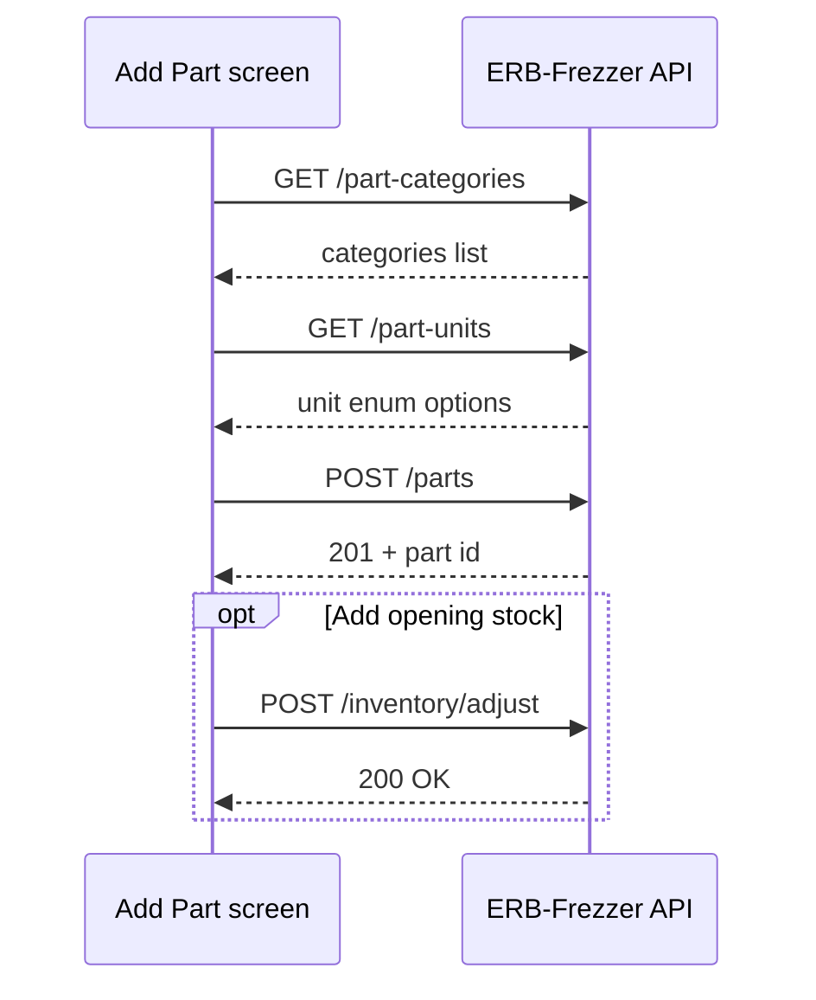

# Flutter — How to add a part

Guide for the **FrostParts Windows** app: create a new product (part) in the ERP via `/api/v1`.

**Requires:** internet, valid login, role **admin** or **manager**.

---

## 1. Flow overview



1. Open **Parts** → **Add part** (hide screen for `salesperson` / `warehouse`).
2. Load dropdown data (categories + units).
3. User fills the form and taps **Save**.
4. Call `POST /parts`.
5. Optional: **Add stock** for a branch (`POST /inventory/adjust`) — new parts start with **0** stock.

---

## 2. Prerequisites

| Item | Detail |
|------|--------|
| Base URL | e.g. `https://your-server.com/api/v1` |
| Token | From `POST /auth/login` → store in secure storage |
| Header | `Authorization: Bearer <token>` on every request |
| Role | `admin` or `manager` (others get **403**) |

Check role after login (`GET /auth/me` → `user.role`).

---

## 3. Load dropdowns (before showing the form)

### Categories

```http
GET /api/v1/part-categories
Authorization: Bearer <token>
```

Example response (array of resources, no wrapper):

```json
[
  {
    "id": "uuid",
    "key": "compressor",
    "name": "Compressor",
    "sort_order": 1,
    "is_active": true
  }
]
```

**Flutter:** Show `name` in the dropdown; keep `key` (or `id`) for the submit payload. Prefer sending **`category_key`** (stable).

### Units (enum)

```http
GET /api/v1/part-units
```

```json
{
  "units": [
    { "value": "pc", "label": "Piece" },
    { "value": "kg", "label": "Kilogram" }
  ]
}
```

**Flutter:** Show `label`; submit **`value`** as `unit` (`pc`, `kg`, `box`, `set`, `m`, `l`, `roll`, `pack`).

Allowed values are fixed in the API enum — do not hardcode only in the app; always load from `GET /part-units` so new enum values work after server updates.

---

## 4. Form fields

| Field | API key | Required | Notes |
|-------|---------|----------|--------|
| Code | `code` | Yes | Unique, max 64 chars, e.g. `BRK-001` |
| Name | `name` | Yes | Display name |
| Category | `category_key` | Yes* | From dropdown (`compressor`, `seals`, …) |
| Category (alt) | `category_id` | Yes* | UUID instead of `category_key` |
| Unit | `unit` | Yes | Enum value: `pc`, `kg`, … |
| Sell price | `sell_price` | Yes | Number ≥ 0 |
| Cost price | `cost_price` | Yes | Number ≥ 0 |
| Min stock | `min_stock` | Yes | Integer ≥ 0 |
| Active | `is_active` | No | Default `true` |

\* One of `category_key` or `category_id` is required.

### Suggested UI layout

```
┌─────────────────────────────────────────┐
│  Add part                          [X]  │
├─────────────────────────────────────────┤
│  Code *        [ BRK-001____________ ]  │
│  Name *        [ Brake pad__________ ]  │
│  Category *    [ Compressor        ▼]  │
│  Unit *        [ Piece (pc)        ▼]  │
│  Sell price *  [ 150.00____________ ]  │
│  Cost price *  [  80.00____________ ]  │
│  Min stock *   [ 5_________________ ]  │
│  Active        [x]                      │
├─────────────────────────────────────────┤
│  [ Cancel ]              [ Save part ]  │
└─────────────────────────────────────────┘
```

After save → dialog: **Add stock now?** → optional stock screen.

---

## 5. Create the part (API)

```http
POST /api/v1/parts
Content-Type: application/json
Accept: application/json
Authorization: Bearer <token>

{
  "code": "BRK-001",
  "name": "Brake pad",
  "category_key": "compressor",
  "unit": "pc",
  "sell_price": 150,
  "cost_price": 80,
  "min_stock": 5,
  "is_active": true
}
```

### Success — `201 Created`

```json
{
  "id": "019e30c6-xxxx-xxxx-xxxx-xxxxxxxxxxxx",
  "code": "BRK-001",
  "name": "Brake pad",
  "category_id": "uuid",
  "category_key": "compressor",
  "category_name": "Compressor",
  "unit": "pc",
  "unit_label": "Piece",
  "sell_price": 150,
  "cost_price": 80,
  "min_stock": 5,
  "is_active": true,
  "created_at": "2026-05-20T10:00:00.000000Z",
  "updated_at": "2026-05-20T10:00:00.000000Z"
}
```

Save `id` for stock adjust and navigation to part detail / analysis.

### Errors

| Status | Meaning | Flutter action |
|--------|---------|----------------|
| `401` | Token invalid/expired | Go to login |
| `403` | Not admin/manager | Show “No permission” |
| `422` | Validation failed | Show field errors from `errors` object |
| `409` / `422` | Duplicate `code` | Highlight code field |

Example `422` (invalid unit):

```json
{
  "message": "The unit field is invalid.",
  "errors": {
    "unit": ["The selected unit is invalid."]
  }
}
```

Example `422` (duplicate code):

```json
{
  "message": "The code has already been taken.",
  "errors": {
    "code": ["The code has already been taken."]
  }
}
```

---

## 6. Flutter / Dio example

```dart
class PartFormData {
  final String code;
  final String name;
  final String categoryKey;
  final String unit; // enum value: pc, kg, ...
  final double sellPrice;
  final double costPrice;
  final int minStock;
  final bool isActive;

  Map<String, dynamic> toJson() => {
        'code': code,
        'name': name,
        'category_key': categoryKey,
        'unit': unit,
        'sell_price': sellPrice,
        'cost_price': costPrice,
        'min_stock': minStock,
        'is_active': isActive,
      };
}

Future<Map<String, dynamic>> createPart(PartFormData form) async {
  final response = await dio.post('/parts', data: form.toJson());
  return response.data as Map<String, dynamic>;
}

Future<List<CategoryOption>> loadCategories() async {
  final response = await dio.get('/part-categories');
  final list = response.data as List<dynamic>;
  return list
      .map((e) => CategoryOption(
            id: e['id'] as String,
            key: e['key'] as String,
            name: e['name'] as String,
          ))
      .toList();
}

Future<List<UnitOption>> loadUnits() async {
  final response = await dio.get('/part-units');
  final list = response.data['units'] as List<dynamic>;
  return list
      .map((e) => UnitOption(
            value: e['value'] as String,
            label: e['label'] as String,
          ))
      .toList();
}
```

Use one shared `Dio` instance with interceptors:

```dart
dio.options.baseUrl = '$apiHost/api/v1';
dio.options.headers['Accept'] = 'application/json';
dio.interceptors.add(InterceptorsWrapper(
  onRequest: (options, handler) {
    final token = await secureStorage.read(key: 'access_token');
    if (token != null) {
      options.headers['Authorization'] = 'Bearer $token';
    }
    handler.next(options);
  },
));
```

---

## 7. Add opening stock (recommended)

New parts have **no stock** until you adjust inventory.

```http
POST /api/v1/inventory/adjust
Authorization: Bearer <token>

{
  "part_id": "<id from create response>",
  "branch_id": "<user.branch_id or selected branch>",
  "quantity_delta": 100,
  "reason": "Opening stock"
}
```

| Role | Can adjust stock? |
|------|-------------------|
| `admin` | Yes |
| `warehouse` | Yes |
| `manager` | No (use admin/warehouse user or separate flow) |

After adjust, refresh POS catalog sync (`GET /inventory/{branchId}`) so offline selling sees the new part.

---

## 8. Permissions & navigation

| `user.role` | Show “Add part”? |
|-------------|------------------|
| `admin` | Yes |
| `manager` | Yes |
| `salesperson` | No (sell only) |
| `warehouse` | No (stock adjust only) |

Route example: `/parts/new` guarded by role check.

---

## 9. Offline

**You cannot add a part offline.** Only **sales** are queued locally when there is no internet.

If the user is offline, disable **Add part** and show: *Connect to the internet to add products.*

---

## 10. Optional: new category first

If the category does not exist in the dropdown:

```http
POST /api/v1/part-categories
{
  "key": "filters",
  "name": "Filters",
  "sort_order": 10,
  "is_active": true
}
```

`key` must be lowercase letters, numbers, underscores only (`filters`, `fan_motor`). Then create the part with `"category_key": "filters"`.

---

## 11. Checklist for developers

- [ ] Login and store Bearer token  
- [ ] `GET /part-categories` on screen open  
- [ ] `GET /part-units` on screen open  
- [ ] Validate required fields before submit  
- [ ] `POST /parts` with `category_key` + `unit` (enum value)  
- [ ] Handle `422` / `403` / `401`  
- [ ] Prompt to add stock via `POST /inventory/adjust`  
- [ ] Sync catalog if POS uses offline cache  

---

## 12. Related API docs

| Topic | Document |
|-------|----------|
| Categories & units | [part-categories-units-api.md](./part-categories-units-api.md) |
| Full Windows ERP app | [flutter-windows-pos-offline-guide.md](./flutter-windows-pos-offline-guide.md) |
| Part analysis screen | [part-analysis-api.md](./part-analysis-api.md) |
| Postman | `postman/ERB-Frezzer-API.postman_collection.json` → **Parts** |
