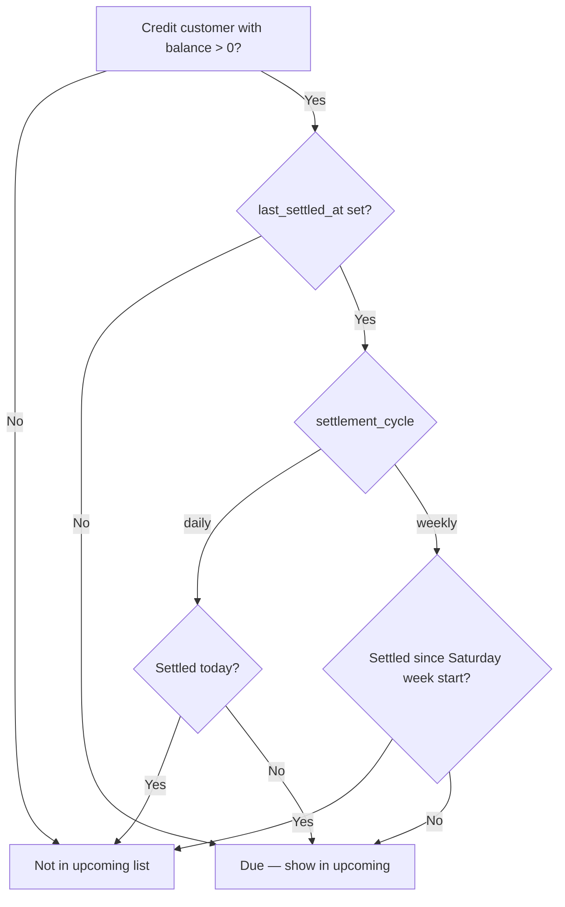

# Customer settlement cycle — daily vs weekly

**Audience:** Shop owner + Flutter Windows (`erd_rezzer`) developers  
**Date:** June 2026  
**API base:** `https://api.tppower.shop/api/v1`

This guide explains **how often each credit customer must pay their balance** — the **settlement cycle**. It is **not** the same as **supplier installments** (paying purchase orders in parts). Both are documented below so nothing gets mixed up.

---

## 1. Two different “cycles” in the app

| Term | Who | Meaning | API area |
|------|-----|---------|----------|
| **Customer settlement cycle** | Credit **customers** (they buy from you on credit) | How often you **collect** their debt: **daily** or **weekly** | `customers.settlement_cycle`, `GET /settlements/upcoming` |
| **Supplier installments** | **Suppliers** (you buy from them on credit) | Scheduled **payments on a purchase order** (e.g. 4 × 25,000 EGP) | `supplier_installments`, `POST /installments/{id}/pay` |

**Customer settlement cycle** = when the shop expects to **receive money from the customer**.  
**Supplier installments** = when the shop **pays the supplier** for a PO.

See also: [flutter-supplier-installment-partial-pay.md](./flutter-supplier-installment-partial-pay.md) (supplier side only).

---

## 2. Customer settlement cycle — business meaning

### Credit customer basics

- Customer `type` = **`credit`** → can buy with `payment_type: credit` on invoices.
- Each credit sale increases `outstanding_balance`.
- Money is collected via:
  1. **Partial payment** — any amount, any time: `POST /customers/{id}/payments`
  2. **Full settlement** — pays **all** open credit invoices at once: `POST /settlements`

### The new field: `settlement_cycle`

On the **customer** record:

| Value | Arabic hint | When collection is expected |
|-------|-------------|-----------------------------|
| **`weekly`** (default) | أسبوعي / تسوية السبت | Once per **week** (week starts **Saturday**). Typical “Saturday settlement” customers. |
| **`daily`** | يومي | **Every calendar day** while they still owe money. |

Only **credit** customers use this field. **Cash** customers have `settlement_cycle: null`.

---

## 3. How the server decides “due now”

The API uses:

- `outstanding_balance` — how much the customer still owes (must be **> 0**)
- `last_settled_at` — last time their balance was fully cleared (settlement or full payment)
- `settlement_cycle` — `daily` or `weekly`



### Weekly (`weekly`)

- Week boundary: **Saturday 00:00** (Carbon `startOfWeek(SATURDAY)`).
- Customer is **due** if they have balance **and** they were **not** fully settled since the start of the current Saturday-based week.

**Example**

| Day | Customer owes | Last settled | In upcoming? |
|-----|---------------|--------------|--------------|
| Wed | 500 EGP | Last Saturday (paid in full) | No — wait until this week’s collection window |
| Sat | 500 EGP | Last Saturday (paid in full) | **Yes** — new week, still has debt |
| Sat | 0 | Today | No |

### Daily (`daily`)

- Customer is **due** if they have balance **and** `last_settled_at` is **not today** (or never settled).

**Example**

| Day | Customer owes | Last settled | In upcoming? |
|-----|---------------|--------------|--------------|
| Mon | 200 EGP | Sunday (paid in full) | **Yes** |
| Mon | 200 EGP | Monday 09:00 (partial pay, still owes) | **Yes** — partial pay does **not** reset daily cycle unless balance hits 0 |
| Mon | 0 | Monday (paid in full) | No until they buy on credit again |

### What updates `last_settled_at`?

| Action | Updates `last_settled_at`? |
|--------|----------------------------|
| `POST /settlements` (full settlement) | **Yes** — set to `settlement_date` |
| `POST /customers/{id}/payments` until balance = **0** | **Yes** — set to now |
| Partial payment (balance still > 0) | **No** |
| New credit invoice | **No** |

---

## 4. API reference (customer settlement)

### Customer JSON (list / detail / create)

```json
{
  "id": "uuid",
  "name": "Shop ABC",
  "type": "credit",
  "credit_limit": 50000,
  "outstanding_balance": 1200,
  "last_settled_at": "2026-06-12T18:00:00.000000Z",
  "settlement_cycle": "daily",
  "branch_id": "uuid-or-null",
  "is_active": true
}
```

| Field | Notes |
|-------|--------|
| `settlement_cycle` | `"daily"` \| `"weekly"` \| `null` (cash customers) |
| `last_settled_at` | ISO timestamp or `null` |
| `outstanding_balance` | Current debt |

> **Note:** API responses are **not** wrapped in a `data` key (`JsonResource::withoutWrapping()`).

### Create credit customer

```http
POST /api/v1/customers
Authorization: Bearer <token>
Content-Type: application/json

{
  "name": "Shop ABC",
  "type": "credit",
  "phone": "01123456789",
  "credit_limit": 50000,
  "settlement_cycle": "daily"
}
```

| Field | Required | Default |
|-------|----------|---------|
| `settlement_cycle` | No | **`weekly`** for credit |
| `branch_id` | No | Set from active branch filter / user branch when possible |

**Admin with branch filter:** also send branch on POST (query or body) so `branch_id` is stored — see [flutter-app-fixes.md](./flutter-app-fixes.md) §11.

### Update cycle on existing customer

```http
PUT /api/v1/customers/{id}
Content-Type: application/json

{
  "settlement_cycle": "daily"
}
```

Cash customer → server clears `settlement_cycle` to `null`.

### Upcoming collections (due list)

```http
GET /api/v1/settlements/upcoming
GET /api/v1/settlements/upcoming?settlement_cycle=daily
GET /api/v1/settlements/upcoming?settlement_cycle=weekly
```

**Response** (array, not paginated):

```json
[
  {
    "customer_id": "uuid",
    "customer_name": "Shop ABC",
    "amount_due": 1200,
    "settlement_cycle": "daily"
  }
]
```

| Field | Meaning |
|-------|---------|
| `amount_due` | Same as customer `outstanding_balance` |
| `settlement_cycle` | `daily` or `weekly` |

Only customers **due according to their cycle** appear here (balance > 0 + schedule rules in §3).

### Collect money (unchanged endpoints)

| Goal | Method | Path |
|------|--------|------|
| Pay **all** open credit (Saturday settlement) | POST | `/settlements` |
| Pay **any amount** (partial / full) | POST | `/customers/{id}/payments` |
| See balance + unpaid invoices | GET | `/customers/{id}/balance` |
| Payment history | GET | `/customers/{id}/payments` |

**Full settlement body:**

```json
{
  "customer_id": "uuid",
  "settlement_date": "2026-06-13",
  "payment_method": "cash",
  "notes": "Saturday collection"
}
```

**Partial payment body:**

```json
{
  "payment_method": "cash",
  "amount": 500,
  "notes": "Daily collection"
}
```

See [flutter-client-notes-june-2026.md](./flutter-client-notes-june-2026.md) Part A for partial payments.

---

## 5. Database

Column on `customers` (in base migration):

```sql
settlement_cycle VARCHAR(16) NOT NULL DEFAULT 'weekly'  -- 'daily' | 'weekly'; nullable for cash in app logic
```

Local refresh:

```bash
php artisan migrate:fresh --seed
```

---

## 6. Flutter — what to edit

### 6.1 Data model

**File:** `lib/data/models/customer.dart` (or equivalent)

```dart
class Customer {
  // ...
  final String? settlementCycle; // 'daily' | 'weekly' | null
  final DateTime? lastSettledAt;

  factory Customer.fromJson(Map<String, dynamic> json) {
    return Customer(
      // ...
      settlementCycle: json['settlement_cycle'] as String?,
      lastSettledAt: json['last_settled_at'] != null
          ? DateTime.parse(json['last_settled_at'] as String)
          : null,
    );
  }
}
```

Persist `settlement_cycle` in local SQLite catalog if you cache customers offline.

### 6.2 Create / edit customer screen

**When `type == credit`**, show a control:

| Label (EN) | Label (AR) | Value sent |
|------------|------------|------------|
| Weekly (Saturday) | أسبوعي (تسوية السبت) | `"weekly"` |
| Daily | يومي | `"daily"` |

```dart
// POST /customers
await dio.post(
  '/customers',
  queryParameters: branchQuery(), // if admin branch filter active
  data: {
    'name': name,
    'type': 'credit',
    'phone': phone,
    'address': address,
    'credit_limit': creditLimit,
    'settlement_cycle': selectedCycle, // 'daily' | 'weekly'
  },
);
```

- Default picker value: **`weekly`**
- Hide cycle picker for **cash** customers
- Show read-only badge on customer detail: **Daily** / **Weekly**

### 6.3 Settlements / collections screen

**File:** settlements or receivables screen

1. Call `GET /settlements/upcoming` on open and after each collection.
2. Optional tabs or chips:
   - **All due**
   - **Daily** → `?settlement_cycle=daily`
   - **Weekly** → `?settlement_cycle=weekly`
3. Each row: customer name, `amount_due`, cycle badge.
4. Actions per row:
   - **Settle all** → `POST /settlements`
   - **Partial pay** → navigate to collect payment → `POST /customers/{id}/payments`

Parse response as a **top-level JSON array** (no `.data` wrapper).

```dart
final rows = (response.data as List)
    .map((e) => SettlementUpcomingRow.fromJson(e as Map<String, dynamic>))
    .toList();
```

### 6.4 Customer list UI (optional but recommended)

| Column / chip | Source |
|---------------|--------|
| Balance | `outstanding_balance` |
| Cycle | `settlement_cycle` |
| Last collected | `last_settled_at` |

Filter locally: “Show daily customers only” using `settlement_cycle == 'daily'`.

### 6.5 Dashboard / reminders

- **Daily customers** with balance → remind **every day** (use upcoming with `?settlement_cycle=daily`).
- **Weekly customers** → remind on **Saturday** (or show weekly tab only near/on Saturday).
- After any successful payment or settlement → refresh upcoming + dashboard receivables.

### 6.6 Do **not** confuse with supplier installments

| Screen | API | Model field |
|--------|-----|-------------|
| Customer collections | `/settlements/upcoming`, `/customers/{id}/payments` | `settlement_cycle` |
| Supplier PO payments | `/installments`, `/installments/{id}/pay` | `installment_no`, `balance_due`, `is_paid` |

Keep separate repositories and screens.

---

## 7. Flutter checklist (PR)

- [ ] `Customer` model: `settlementCycle`, `lastSettledAt` from JSON
- [ ] Create/edit credit customer: cycle picker (`daily` / `weekly`, default weekly)
- [ ] POST customer includes `settlement_cycle` for credit
- [ ] POST customer includes `branch_id` (query or body) when admin branch filter active
- [ ] Settlements screen uses `GET /settlements/upcoming` (array response, no `data` key)
- [ ] Optional filter tabs: daily / weekly
- [ ] Row actions: full settlement + partial payment
- [ ] Refresh upcoming after `POST /settlements` or `POST /customers/{id}/payments`
- [ ] Supplier installments screen unchanged (different API)
- [ ] Offline catalog stores `settlement_cycle` if customers are cached

---

## 8. Quick comparison table

| | **Daily customer** | **Weekly customer** |
|--|---------------------|---------------------|
| **Typical use** | Small shops, high turnover, collect every day | Regular accounts, collect on Saturday |
| **Default** | No — must choose explicitly | **Yes** (default on create) |
| **Upcoming list** | Every day with balance (if not fully paid today) | When balance exists and not settled this Sat-week |
| **Collection API** | Partial pay daily + optional full settlement | Saturday `POST /settlements` or partial pay anytime |
| **Field** | `settlement_cycle: "daily"` | `settlement_cycle: "weekly"` |

---

## 9. Tests (backend)

```bash
php artisan test --filter=CustomerSettlementCycleTest
```

---

## 10. Related docs

- [flutter-client-notes-june-2026.md](./flutter-client-notes-june-2026.md) — partial customer payments
- [flutter-supplier-installment-partial-pay.md](./flutter-supplier-installment-partial-pay.md) — supplier installments (different feature)
- [flutter-dashboard-transactions-guide.md](./flutter-dashboard-transactions-guide.md) — Saturday settlement flow
- [flutter-app-fixes.md](./flutter-app-fixes.md) — branch on customer POST, dropdown fixes
