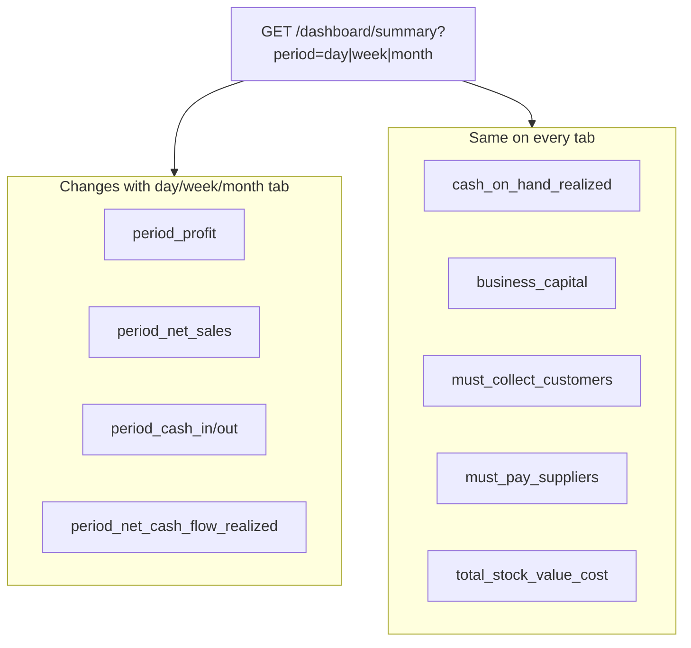

# Flutter — Dashboard Period Numbers Validation

**Audience:** `erd_rezzer` Flutter team  
**Backend:** ERB-Frezzer `/api/v1`  
**Date:** June 2026

This doc explains which dashboard numbers are correct, which are Flutter bugs, and how to bind fields so day / week / month tabs stay internally consistent.

---

## ملخص بالعربي

**الخادم (API) يحسب الأرقام بشكل صحيح.** الاختبارات الآلية ومراجعة لقطات الشاشة تؤكد أن المعادلات صحيحة عندما تُستخدم الحقول من **نفس** استجابة الـ API.

المشاكل الظاهرة في الواجهة غالباً من Flutter:

1. عدم إعادة جلب الملخص مع `period=month` عند اختيار تبويب الشهر (الافتراضي على الخادم هو `week`).
2. عرض نطاق تاريخ خاطئ في تبويب «اليوم» (يومان بدل يوم واحد).
3. خلط حقول من استجابات مختلفة أو كاش قديم (مثلاً ربح 10904.93 مع تأثير مرتجع 565 بدل 545).
4. حساب «تكلفة البضاعة» كـ `مبيعات − ربح` بدل `إيراد − إجمالي الربح`.
5. تسمية بطاقات اللقطة الحالية (النقد، رأس المال، المدينون) بـ «اليوم/الأسبوع» رغم أنها لا تتغير مع الفترة.
6. خلط **صافي التدفق النقدي** (`period_net_cash_flow_realized`) مع **النقد في الصندوق** (`cash_on_hand_realized`) أو عرض رقم الشهر (−77,271.73) في تبويب الأسبوع.

---

## English summary

**Backend period filtering is correct.** Tests in `DashboardPeriodFilterTest` and `DashboardFullSystemIntegrityTest` pass. Screenshot math checks out when all cards read from the **same** API response.

Likely Flutter issues:

1. Summary not re-fetched with `period=month` on month tab (API defaults to `week`).
2. Day tab header shows a 2-day range instead of one day from `period.from` / `period.to`.
3. Stale cache or mixed fields across tab switches (e.g. profit 10904.93 with refund impact 565 instead of 545).
4. COGS computed as `revenue − profit` instead of `revenue − gross_profit`.
5. Snapshot cards (cash, capital, receivables) incorrectly labeled with period suffixes.
6. Net cash flow (`period_net_cash_flow_realized`) confused with cash on hand (`cash_on_hand_realized`), or month value (−77,271.73) shown on the week tab.

---

## API contract

### Request

```http
GET /api/v1/dashboard/summary?period=day|week|month&date=YYYY-MM-DD&branch_id={uuid}
```

| Param | Values | Default |
|-------|--------|---------|
| `period` | `day`, `week`, `month` | `week` |
| `date` | `YYYY-MM-DD` | today |
| `branch_id` | UUID | — (admin only) |

### Rules for Flutter

1. **Re-fetch on every tab change** — pass `period` in the query string; do not reuse a cached summary from another period.
2. **Verify** `response.period.key` matches the selected tab.
3. **Replace the entire summary model** on each fetch — do not update hero profit from one response and breakdown rows from another.
4. **Use `period_*` fields only** — `weekly_*` mirrors the selected period but the name is legacy (misleading when `period=day` or `period=month`).
5. **Display the date header** from `period.from` and `period.to` returned by the API.

### Period windows

| `period` | Range |
|----------|--------|
| `day` | Start of anchor day → end of anchor day (**one day**) |
| `week` | **Business week:** Monday **09:00** → Friday **23:59:59** (Sat/Sun = completed week; Mon before 9 AM = previous week) |
| `month` | Start of month containing anchor → end of that month |

---

## Two kinds of dashboard numbers



**Period-scoped** — profit, sales, discounts, refunds, period cash flow.  
**Snapshot** — cash on hand, business capital, receivables, payables, inventory. These reflect **now**, not the selected window.

---

## Field mapping — period-scoped cards

Bind labels to `period.key`:

| `period.key` | Hero profit label (AR) | Hero profit label (EN) |
|--------------|------------------------|------------------------|
| `day` | ربح اليوم | Today's profit |
| `week` | ربح الأسبوع | Week's profit |
| `month` | ربح الشهر | Month's profit |

| UI label (AR) | UI label (EN) | API field | Formula / notes |
|---------------|---------------|-----------|-----------------|
| ربح اليوم/الأسبوع/الشهر | Period profit | `period_profit` | `period_gross_profit − period_discount − period_customer_refund_profit_impact` (floored ≥ 0) |
| صافي المبيعات | Net sales | `period_net_sales` | Invoice totals − refunds (API computed) |
| إجمالي الربح | Gross profit | `period_gross_profit` | Σ `(unit_price − unit_cost) × qty` |
| الخصومات | Discounts | `period_discount` | Sum of invoice discounts |
| مرتجعات المبيعات | Sales returns | `period_customer_refunds` | Refund total in window |
| تأثير المرتجع على الربح | Refund profit impact | `period_customer_refund_profit_impact` | **Margin lost** on returns only — not full sale price |
| تكلفة البضاعة | Cost of goods | **client calc** | `period_revenue − period_gross_profit` |
| الهامش % | Margin % | **client calc** | `period_profit / period_net_sales × 100` (guard ÷0) |
| صافي التدفق النقدي | Net cash flow | `period_net_cash_flow_realized` | `period_cash_in_realized − period_cash_out_realized` |
| نقد داخل | Cash in | `period_cash_in_realized` | Cash sales + collections + settlements in window |
| نقد خارج | Cash out | `period_cash_out_realized` | Supplier payments + refund cash-outs + owner cash-outs in window |

### Profit formula (always verify in UI)

```
period_profit ≈ period_gross_profit − period_discount − period_customer_refund_profit_impact
```

Tolerance: ±0.01 for rounding.

### COGS — do NOT use revenue − profit

```
period_cogs = period_revenue − period_gross_profit
```

Using `period_revenue − period_profit` double-counts discounts and refund margin impact. It only matches when discount and refunds are zero.

### Margin

```
margin_percent = period_net_sales > 0
    ? (period_profit / period_net_sales) * 100
    : 0
```

Use `period_net_sales` as denominator, not `period_revenue`.

---

## Field mapping — snapshot cards

**Do not** suffix these with اليوم / الأسبوع / الشهر. They do not change when the user switches the period tab.

| UI label (AR) | UI label (EN) | API field |
|---------------|---------------|-----------|
| النقد في الصندوق | Cash on hand | `cash_on_hand_realized` |
| رأس المال | Business capital | `business_capital` |
| المدينون — عملاء | Debtors (customers) | `must_collect_customers` |
| الدائنون — موردون | Creditors (suppliers) | `must_pay_suppliers` |
| المخزون (بالتكلفة) | Inventory at cost | `total_stock_value_cost` |

### Business capital check

```
business_capital ≈ total_stock_value_cost + cash_on_hand_realized
```

See [flutter-business-capital-definition.md](./flutter-business-capital-definition.md).

---

## Net cash flow — صافي التدفق النقدي

### What it is (and what it is NOT)

**صافي التدفق النقدي** = real cash that moved **during the selected period only**.

```
period_net_cash_flow_realized = period_cash_in_realized − period_cash_out_realized
```

| Field | Arabic | Meaning |
|-------|--------|---------|
| `period_cash_in_realized` | نقد داخل | Cash **into** the drawer in the window |
| `period_cash_out_realized` | نقد خارج | Cash **out of** the drawer in the window |
| `period_net_cash_flow_realized` | صافي التدفق النقدي | In − out for the window |

**Cash in includes:**

- Cash invoices (`payment_type = cash`)
- Customer payments collected (non-offset)
- Saturday settlements (non-offset)

**Cash out includes:**

- Supplier installment payments (non-offset)
- Customer return cash refunds (`refund_cash`, `writeoff`)
- Owner cash-outs

**Does NOT affect period net cash flow:**

- Credit invoices (receivable created, no cash yet)
- Purchase orders before installment payment
- Credit-note returns (balance adjustment, no cash)
- Offset / مقاصة payments

### NOT the same as النقد في الصندوق

| Field | Scope | Meaning |
|-------|-------|---------|
| `period_net_cash_flow_realized` | **Selected period** | Net movement in/out during day/week/month |
| `cash_on_hand_realized` | **Lifetime snapshot** | Opening cash + all-time cash in − all-time cash out |

`cash_on_hand_realized` stays **the same** when switching day/week/month tabs.  
`period_net_cash_flow_realized` **changes** with the tab.

**Do not** compute net cash flow as:

```
(cash_on_hand_realized + must_collect_customers) − must_pay_suppliers   ← WRONG
```

Example from screenshots: `(21,728.27 + 18,665.00) − 113,999.98 = −73,606.71` — this is **not** `period_net_cash_flow_realized` and must not be labeled صافي التدفق النقدي.

### Screenshot validation (June 2026)

| Tab | صافي التدفق | نقد داخل | نقد خارج | Verdict |
|-----|-------------|----------|----------|---------|
| **Month** | **−77,271.73** | 75,395.80 | 152,667.53 | ✅ 75,395.80 − 152,667.53 = −77,271.73 |
| **Day** | **1,190.00** | — | — | ✅ Plausible — short window, differs from month |
| **Week** | **72,380.80** (صافي الدخل الأسبوعي) | — | — | ⚠️ OK **if** fetched with `period=week` |
| **Week** | **−77,271.73** (under «نقد خارج السيولة») | — | — | ❌ **Same as month** — wrong period or wrong field |

**Month tab:** internally consistent — backend formula checks out.

**Week tab:** shows two cash numbers. `−77,271.73` is exactly the **month** net cash flow displayed on the week screen. Flutter is either:

- Not passing `period=week` for all cash cards, or
- Mixing `period_net_cash_flow_realized` from a cached month response with week data, or
- Mislabeling a card (e.g. «نقد خارج السيولة») with the wrong API field

**Day tab (`1,190.00`):** cannot be verified from the screenshot alone, but differing from month/week is **expected**.

### Recommended UI layout

```
صافي التدفق النقدي          {period_net_cash_flow_realized}
  نقد داخل  {period_cash_in_realized}
  نقد خارج  {period_cash_out_realized}
```

Label suffix by `period.key`:

| `period.key` | Hero label (AR) |
|--------------|-----------------|
| `day` | صافي التدفق النقدي — اليوم |
| `week` | صافي التدفق النقدي — الأسبوع |
| `month` | صافي التدفق النقدي — الشهر |

Bind **in + out + net** from the **same** summary response. Never show `weekly_net_cash_flow_realized` in new code — use `period_net_cash_flow_realized`.

### Flutter verify after each fetch

```dart
bool netCashFlowConsistent(DashboardSummary s) {
  final expected = s.periodCashIn - s.periodCashOut;
  return (s.periodNetCashFlow - expected).abs() < 0.02;
}
```

Optional debug assert in development:

```dart
assert(
  netCashFlowConsistent(summary),
  'Cash flow mismatch: in=${summary.periodCashIn} out=${summary.periodCashOut} '
  'net=${summary.periodNetCashFlow}',
);
```

### Common mistakes

| Mistake | Symptom | Fix |
|---------|---------|-----|
| Show `cash_on_hand_realized` as صافي التدفق | Same number on every tab | Use `period_net_cash_flow_realized` |
| Client-side liquidity formula | Number ≠ API net cash flow | Remove custom formula; use API fields |
| Stale month net on week tab | −77,271.73 on week screen | Re-fetch with `period=week`; replace full model |
| `weekly_net_cash_flow_realized` on month tab | Name says week, period is month | Use `period_*` only |
| Missing in/out breakdown | User cannot verify net | Show `period_cash_in` and `period_cash_out` sub-rows |

See also [flutter-dashboard-real-cash-boxes.md](./flutter-dashboard-real-cash-boxes.md).

---

## Screenshot validation (June 2026)

Review of production dashboard screenshots. Backend math is OK where fields are consistent.

### Correct — keep behavior

| View | Check | Result |
|------|-------|--------|
| Day | Profit: 3360 − 2657.35 = **702.65** | OK |
| Day | Margin: 702.65 / 3360 ≈ **20.9%** | OK |
| Day | Period net cash flow **1190.00** (differs from week/month) | OK |
| Month | Profit: 11492.78 − 42.85 − 545.00 = **10904.93** | OK |
| Month | Margin: 10904.93 / 82625.80 ≈ **13.2%** | OK |
| Month | Cash flow: 75395.80 − 152667.53 = **−77271.73** | OK |
| All tabs | Business capital: 21728.27 + 385527.23 = **407255.50** | OK |
| All tabs | Cash, receivables, payables unchanged across tabs | OK (by design) |

### Wrong — Flutter fixes required

| Issue | Symptom | Fix |
|-------|---------|-----|
| Stale / mixed response | Week shows refund impact **565** but profit **10904.93** (needs impact **545**) | Single fetch per tab; replace full model |
| Missing `period=month` | Week and month show identical profit KPIs while cash flow differs | Pass `period` on every tab change |
| Wrong date header | Day tab shows **19–20 June** (two days) | Format `period.from`–`period.to`; day = one date |
| Wrong COGS | `sales − profit` used for تكلفة البضاعة | Use `period_revenue − period_gross_profit` |
| Currency mix | «جنيه» and «EGP» on same screen | Pick one format |
| Legacy fields | `weekly_profit` bound to month tab | Use `period_profit` |
| Week cash flow mixed | Week shows **−77,271.73** (month value) and **72,380.80** (week value) on same screen | All cash cards from one `period=week` response; bind net to `period_net_cash_flow_realized` |

---

## Flutter implementation

### Tab change — correct pattern

```dart
enum DashboardPeriod { day, week, month }

Future<DashboardSummary> loadSummary({
  required DashboardPeriod period,
  DateTime? anchorDate,
  String? branchId,
}) async {
  final res = await _dio.get('/dashboard/summary', queryParameters: {
    'period': period.name,
    if (anchorDate != null) 'date': _formatDate(anchorDate),
    if (branchId != null) 'branch_id': branchId,
  });
  final summary = DashboardSummary.fromJson(res.data);
  assert(
    summary.period.key == period.name,
    'API period ${summary.period.key} != requested ${period.name}',
  );
  return summary;
}
```

### On period tab tap

```dart
void onPeriodChanged(DashboardPeriod period) {
  setState(() => _loading = true);
  loadSummary(period: period).then((summary) {
    setState(() {
      _summary = summary; // replace entire object
      _loading = false;
    });
  });
}
```

### Date header

```dart
String formatPeriodRange(PeriodInfo period) {
  final from = DateTime.parse(period.from);
  final to = DateTime.parse(period.to);
  if (period.key == 'day') {
    return formatDate(from); // single day only
  }
  return '${formatDate(from)} – ${formatDate(to)}';
}
```

### Derived values (client-side only)

```dart
double costOfGoods(DashboardSummary s) =>
    s.periodRevenue - s.periodGrossProfit;

double marginPercent(DashboardSummary s) =>
    s.periodNetSales > 0
        ? (s.periodProfit / s.periodNetSales) * 100
        : 0;

bool netCashFlowConsistent(DashboardSummary s) {
  final expected = s.periodCashIn - s.periodCashOut;
  return (s.periodNetCashFlow - expected).abs() < 0.02;
}
```

### Do NOT

- Cache summary across period tabs without re-fetching
- Update only the hero card on tab change while leaving breakdown rows from the previous period
- Bind `weekly_profit`, `weekly_revenue`, etc. in new code
- Label `cash_on_hand_realized` or `business_capital` with period suffixes
- Compute profit client-side by subtracting refunds from revenue (use API `period_profit`)
- Show `period_net_cash_flow_realized` in the snapshot cash-on-hand card (that is lifetime position)

### DO refresh after

- Invoice create / return approve
- Customer payment / settlement
- Supplier installment pay
- Purchase create / receive
- Owner cash-out
- `PUT /settings/capital` (opening cash)

Use the **same** `period` param on summary, sales, and cash endpoints.

---

## QA checklist

Copy into your release checklist:

- [ ] `period=day` shows only today's sales (`period_revenue` for today only)
- [ ] `period=month&date=...` shows that calendar month
- [ ] Day profit ≠ week/month profit when today has different activity
- [ ] `period_profit = period_gross_profit − period_discount − period_customer_refund_profit_impact` (±0.01)
- [ ] `period_net_cash_flow_realized = period_cash_in_realized − period_cash_out_realized` (±0.01)
- [ ] Net cash flow **changes** when switching day/week/month (unless no activity in any window)
- [ ] `cash_on_hand_realized` **unchanged** when switching period (snapshot, not period metric)
- [ ] Week tab does **not** show month net cash flow (−77,271.73) under a different label
- [ ] Cash in + cash out breakdown visible and matches net on every tab
- [ ] `business_capital ≈ total_stock_value_cost + cash_on_hand_realized`
- [ ] Date header matches `period.from`–`period.to` (one day for `period=day`)
- [ ] Tab labels match `period.key` (`day` → اليوم, `week` → هذا الأسبوع, `month` → هذا الشهر)
- [ ] Hero profit and all breakdown rows come from the **same** API response
- [ ] `must_collect_customers` unchanged when switching period
- [ ] Sales screen uses the same `period` param as summary

---

## Related docs

- [flutter-dashboard-period-filter.md](./flutter-dashboard-period-filter.md) — query params and endpoints
- [flutter-dashboard-real-cash-boxes.md](./flutter-dashboard-real-cash-boxes.md) — cash boxes
- [flutter-business-capital-definition.md](./flutter-business-capital-definition.md) — رأس المال
- [flutter-client-notes-june-2026.md](./flutter-client-notes-june-2026.md) — return profit impact rules
