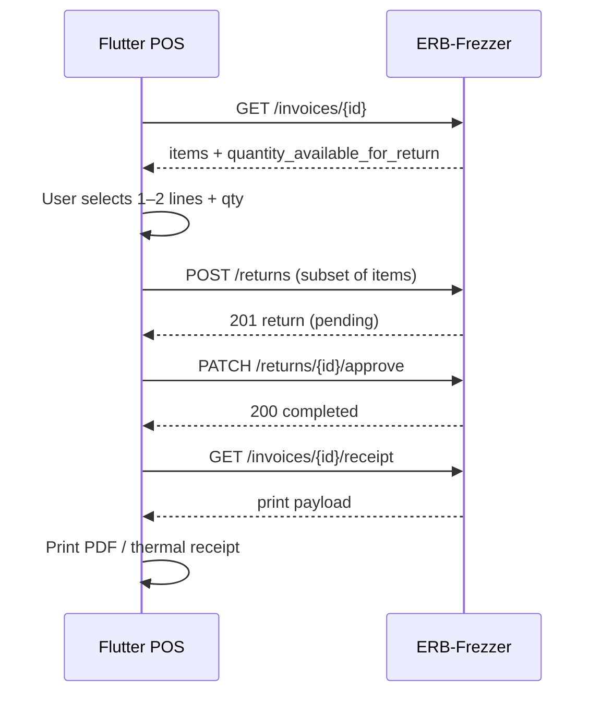

# Flutter — partial invoice return & reprint

Guide for **erd_rezzer** / FrostParts when a customer returns **one or two lines** from an invoice that had **many items** (e.g. 10 sold, return 2), then **print the invoice again** showing what was returned and what remains.

**API base:** `/api/v1`  
**Related:** [customer-returns-ar.md](./customer-returns-ar.md), [flutter-app-fixes.md](./flutter-app-fixes.md) §5, [flutter-dashboard-transactions-guide.md](./flutter-dashboard-transactions-guide.md)

---

## 1. Business flow



| Step | What happens |
|------|----------------|
| 1 | Open invoice (search by number / customer / today list) |
| 2 | Show **every invoice line** with sold qty and **how many can still be returned** |
| 3 | User picks lines (checkbox) and return qty (stepper, max = available) |
| 4 | Create return → manager approves (or auto if admin) |
| 5 | **Reprint** using `GET /invoices/{id}/receipt` |

The **original invoice row in the database is not rewritten**. Returns are separate documents linked by `reference_id` = invoice UUID.

---

## 2. API summary

| Method | Path | Purpose |
|--------|------|---------|
| `GET` | `/invoices/{id}` | Invoice + items + **return quantities per line** |
| `GET` | `/invoices/{id}/receipt` | **Print/reprint** payload (invoice + returns + summary) |
| `POST` | `/returns` | Create return with **only selected items** |
| `PATCH` | `/returns/{id}/approve` | Apply stock / refund |
| `PATCH` | `/returns/{id}/reject` | Cancel pending return |

---

## 3. Load invoice lines for the return screen

```http
GET /api/v1/invoices/{invoiceId}
Authorization: Bearer <token>
```

Each item now includes return helpers (added for Flutter):

| Field | Meaning |
|-------|---------|
| `quantity` | Sold on this line (same as before) |
| `quantity_sold` | Total sold for this `part_id` on the invoice (sum of lines if duplicate part) |
| `quantity_returned_completed` | Already approved/completed returns |
| `quantity_returned_pending` | Pending return not yet approved |
| `quantity_available_for_return` | Max qty user can put on **this** new return |
| `quantity_remaining` | Sold − completed − pending (kept on invoice) |

Example (invoice had 10 units of one part, customer returns 2 pending):

```json
{
  "id": "invoice-uuid",
  "invoice_number": "INV-00042",
  "return_status": "partial",
  "total": 500,
  "items": [
    {
      "id": "line-uuid",
      "part_id": "part-uuid",
      "quantity": 10,
      "unit_price": 50,
      "total": 500,
      "quantity_sold": 10,
      "quantity_returned_completed": 0,
      "quantity_returned_pending": 2,
      "quantity_available_for_return": 8,
      "quantity_remaining": 8,
      "part": { "code": "P-100", "name": "Filter" }
    }
  ]
}
```

### `return_status` on invoice

| Value | UI |
|-------|-----|
| `none` | Allow return |
| `partial` | Allow return on lines where `quantity_available_for_return` > 0 |
| `returned` | **Hide** “Return” — everything already returned |

---

## 4. Return UI (Flutter)

### 4.1 Screen layout

```
┌──────────────────────────────────────────────┐
│  Return items — INV-00042                    │
│  Customer: Ahmed                             │
├──────────────────────────────────────────────┤
│ [x] P-100  Filter          Sold 10           │
│     Return qty: [ 2 ▼]   Available: 8        │
│     Condition: (•) Sellable  ( ) Defective    │
│                                              │
│ [ ] P-200  Gasket          Sold 5            │
│     Return qty: [ 0 ▼]   Available: 5        │
├──────────────────────────────────────────────┤
│  Refund total: 100.00                        │
│  [ Cancel ]              [ Submit return ]   │
└──────────────────────────────────────────────┘
```

### 4.2 Rules

- Send **only checked lines** with `quantity` > 0 in `POST /returns`.
- `unit_price` on each return line = invoice line `unit_price` (not catalog price).
- `reference_id` = **`invoice.id`** (UUID), **not** `customer_id`.
- `reference_type` = `"invoice"`.
- `customer_id` = invoice’s customer.
- `branch_id` = invoice’s branch.

### 4.3 Create return (partial — 2 of 10 items)

```http
POST /api/v1/returns
Content-Type: application/json

{
  "return_type": "customer_return",
  "reference_id": "invoice-uuid",
  "reference_type": "invoice",
  "customer_id": "customer-uuid",
  "branch_id": "branch-uuid",
  "reason": "Customer brought 2 filters back",
  "items": [
    {
      "part_id": "part-uuid",
      "quantity": 2,
      "unit_price": 50,
      "condition": "sellable"
    }
  ]
}
```

You can return **multiple parts in one request** (two different `part_id`s) as long as each qty ≤ `quantity_available_for_return`.

### 4.4 Approve

```http
PATCH /api/v1/returns/{returnId}/approve
{ "resolution": "refund_cash" }
```

| Resolution | Use when |
|------------|----------|
| `refund_cash` | Cash customer, money back |
| `credit_note` | Credit customer, reduce balance |
| `writeoff` | Defective + refund money |
| `restock` | Item OK, no cash refund in reports |

After approve: refresh inventory + dashboard (see [flutter-dashboard-transactions-guide.md](./flutter-dashboard-transactions-guide.md)).

### 4.5 Errors (422)

```json
{
  "message": "Return quantity exceeds what is available on this document.",
  "failures": [
    {
      "part_id": "uuid",
      "requested": 5,
      "sold": 10,
      "already_returned": 8,
      "available": 2
    }
  ]
}
```

Show: *“You can only return 2 more of this item.”*

---

## 5. Reprint invoice after return

Use the dedicated **receipt** endpoint (do not guess totals in the app).

```http
GET /api/v1/invoices/{invoiceId}/receipt
Authorization: Bearer <token>
```

### Response shape

```json
{
  "invoice": {
    "invoice_number": "INV-00042",
    "total": 450,
    "return_status": "partial",
    "customer": { "name": "Ahmed" },
    "branch": { "name": "Main" }
  },
  "items": [
    {
      "part_id": "uuid",
      "quantity": 10,
      "unit_price": 50,
      "line_total": 500,
      "quantity_returned_completed": 2,
      "quantity_returned_pending": 0,
      "quantity_remaining": 8,
      "part": { "code": "P-100", "name": "Filter" }
    }
  ],
  "returns": [
    {
      "return_number": "RET-00007",
      "status": "completed",
      "resolution": "refund_cash",
      "total_value": 100,
      "items": [
        { "part_code": "P-100", "quantity": 2, "unit_price": 50 }
      ]
    }
  ],
  "summary": {
    "original_subtotal": 450,
    "original_discount": 0,
    "original_total": 450,
    "returned_value_completed": 100,
    "returned_value_pending": 0,
    "net_total_after_completed_returns": 350
  }
}
```

### What to print (recommended layout)

**Option A — Single updated statement (recommended)**

1. Header: shop name, branch, date, `invoice_number`  
2. Customer name  
3. Table:

| Code | Name | Sold | Returned | Remaining | Price | Line total |
|------|------|------|----------|-----------|-------|------------|

Use `items[].quantity` as sold, `quantity_returned_completed` as returned, `quantity_remaining` as kept.

4. Footer:
   - Original total: `summary.original_total`
   - Returns (completed): `summary.returned_value_completed`
   - **Net after returns:** `summary.net_total_after_completed_returns`
5. Section **“Returns on this invoice”**: list `returns[]` with `return_number`, date, amount.

**Option B — Two slips**

1. Original invoice (unchanged totals) — `GET /invoices/{id}` without summary  
2. Return slip — one `returns[]` entry

Option A matches customer expectation after partial return.

### Flutter print example

```dart
import 'package:printing/printing.dart';
import 'package:pdf/pdf.dart';
import 'package:pdf/widgets.dart' as pw;

Future<void> printInvoiceReceipt(String invoiceId) async {
  final res = await dio.get('/invoices/$invoiceId/receipt');
  final data = res.data as Map<String, dynamic>;
  final invoice = data['invoice'] as Map<String, dynamic>;
  final items = data['items'] as List<dynamic>;
  final summary = data['summary'] as Map<String, dynamic>;

  final doc = pw.Document();
  doc.addPage(
    pw.MultiPage(
      build: (context) => [
        pw.Text('Invoice ${invoice['invoice_number']}', style: pw.TextStyle(fontSize: 18)),
        pw.Text('Customer: ${invoice['customer']?['name'] ?? ''}'),
        pw.SizedBox(height: 12),
        pw.Table.fromTextArray(
          headers: ['Code', 'Name', 'Sold', 'Ret.', 'Left', 'Total'],
          data: items.map((row) {
            final part = row['part'] as Map<String, dynamic>?;
            return [
              part?['code'] ?? '',
              part?['name'] ?? '',
              '${row['quantity']}',
              '${row['quantity_returned_completed']}',
              '${row['quantity_remaining']}',
              '${row['line_total']}',
            ];
          }).toList(),
        ),
        pw.SizedBox(height: 12),
        pw.Text('Original total: ${summary['original_total']}'),
        pw.Text('Returned: ${summary['returned_value_completed']}'),
        pw.Text('Net after returns: ${summary['net_total_after_completed_returns']}'),
      ],
    ),
  );

  await Printing.layoutPdf(onLayout: (format) async => doc.save());
}
```

Call **after** approve succeeds (or after create if you only print pending for internal copy).

---

## 6. Dart helpers

```dart
class InvoiceReturnLine {
  InvoiceReturnLine.fromJson(Map<String, dynamic> json, this.partLabel)
      : partId = json['part_id'] as String,
        sold = json['quantity'] as int,
        unitPrice = (json['unit_price'] as num).toDouble(),
        available = json['quantity_available_for_return'] as int? ?? json['quantity'] as int;

  final String partId;
  final String partLabel;
  final int sold;
  final double unitPrice;
  final int available;
  int returnQty = 0;
  String condition = 'sellable';

  bool get selected => returnQty > 0;

  Map<String, dynamic> toReturnItemJson() => {
        'part_id': partId,
        'quantity': returnQty,
        'unit_price': unitPrice,
        'condition': condition,
      };
}

Future<List<InvoiceReturnLine>> loadReturnableLines(String invoiceId) async {
  final res = await dio.get('/invoices/$invoiceId');
  final items = res.data['items'] as List<dynamic>;
  return items
      .where((e) => (e['quantity_available_for_return'] as int? ?? 0) > 0)
      .map((e) {
        final part = e['part'] as Map<String, dynamic>?;
        final label = '${part?['code'] ?? ''} ${part?['name'] ?? ''}'.trim();
        return InvoiceReturnLine.fromJson(e as Map<String, dynamic>, label);
      })
      .toList();
}
```

---

## 7. Multiple return visits

Customer can return **2 items today** and **3 more next week** on the same invoice:

1. First return: qty 2 → `return_status` = `partial`  
2. Second return: up to `quantity_available_for_return` on each line  
3. When all sold qty is returned → `return_status` = `returned` → block new returns  

Pending returns **reserve** quantity (`quantity_returned_pending`) so two cashiers cannot over-return.

---

## 8. Checklist for developers

- [ ] Return screen loads `GET /invoices/{id}` and lists **all** items  
- [ ] Stepper max = `quantity_available_for_return`  
- [ ] `reference_id` = invoice UUID  
- [ ] Submit only selected lines  
- [ ] Approve → refresh stock + dashboard  
- [ ] Reprint uses `GET /invoices/{id}/receipt`  
- [ ] Print shows sold / returned / remaining + net total  
- [ ] Hide return when `return_status == 'returned'`  
- [ ] Handle 422 `failures[].available`  

---

## 9. Backend changes (May 2026)

| Change | Detail |
|--------|--------|
| `GET /invoices/{id}` | Items include `quantity_*_return` fields |
| `GET /invoices/{id}/receipt` | **New** — print payload with `returns[]` + `summary` |
| Partial returns | Already supported; validator enforces per-line limits |

Tests: `php artisan test --filter=InvoicePartialReturnReceiptTest`

---

## 10. Arabic quick reference

| English | Arabic |
|---------|--------|
| Partial return | مرتجع جزئي |
| Available to return | الكمية المتاحة للإرجاع |
| Reprint invoice | إعادة طباعة الفاتورة |
| Net after returns | الصافي بعد المرتجعات |

See [customer-returns-ar.md](./customer-returns-ar.md).
