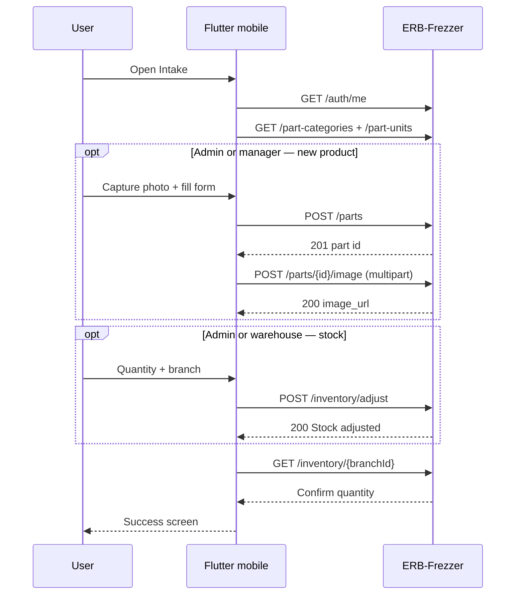

# Flutter mobile — Inventory intake (photo → part → stock)

Developer guide for a **Flutter mobile** app (Android / iOS) that lets warehouse staff **photograph a physical item**, **create a catalog part** on **ERB-Frezzer**, and **add opening quantity** to branch inventory.

**Backend:** ERB-Frezzer REST API (`/api/v1`)  
**Example production base:** `https://api.tppower.shop/api/v1`  
**Related docs:** [flutter-add-part.md](./flutter-add-part.md), [part-image-api.md](./part-image-api.md), [part-categories-units-api.md](./part-categories-units-api.md), [flutter-windows-pos-offline-guide.md](./flutter-windows-pos-offline-guide.md)

---

## 1. Product goal

| Step | User action | Server effect |
|------|-------------|---------------|
| 1 | Take or pick a photo of the item | (local file only) |
| 2 | Enter / scan code, name, category, prices | `POST /parts` → new row in `parts` |
| 3 | Upload photo | `POST /parts/{id}/image` → public `image_url` |
| 4 | Enter quantity for a branch | `POST /inventory/adjust` → `stock` + `stock_movements` |

After success, the part appears in `GET /inventory/{branchId}` and can be sold on the Windows POS after its catalog sync.

**This flow requires internet.** The API does not accept offline part creation or stock uploads (unlike POS invoice queuing on Windows).

---

## 2. Who can use the app (roles)

API permissions are **split across roles**. Plan the mobile app accordingly.

| Action | Endpoint | Allowed roles |
|--------|----------|---------------|
| Login | `POST /auth/login` | Any active user |
| List categories / units | `GET /part-categories`, `GET /part-units` | Any authenticated |
| Search parts | `GET /parts?search=` | Any authenticated |
| **Create part** | `POST /parts` | **admin**, **manager** |
| **Upload image** | `POST /parts/{id}/image` | **admin**, **manager** |
| **Adjust stock** | `POST /inventory/adjust` | **admin**, **warehouse** |
| List branches (pick stock branch) | `GET /branches/active` | Any authenticated |

### Recommended mobile personas

| Persona | `user.role` | Mobile app mode |
|---------|-------------|-----------------|
| **Full intake** | `admin` | Photo → create part → upload image → add stock (one login) |
| **Catalog only** | `manager` | Photo → create part → upload image → **cannot** call `inventory/adjust`; show “Ask warehouse to receive stock” or switch user |
| **Stock only** | `warehouse` | Search existing part → **add stock only** (no create / no image upload) |
| **Blocked** | `salesperson` | Hide intake module (POS selling only) |

**Practical deployment:** issue **admin** or **warehouse** accounts for the intake app, or build **two entry paths** in one app (“New product” vs “Add stock to existing”).

Check after login:

```http
GET /api/v1/auth/me
Authorization: Bearer <token>
```

```json
{
  "id": "uuid",
  "name": "Warehouse User",
  "email": "wh@example.com",
  "role": "warehouse",
  "branch_id": "branch-uuid",
  "is_active": true,
  "can_select_branch": false,
  "accessible_branch_ids": ["branch-uuid"],
  "branch": { "id": "branch-uuid", "name": "Main Store" }
}
```

- `can_select_branch: true` → admin (or user with no `branch_id`): show branch picker for stock.
- `can_select_branch: false` → lock stock to `branch_id` / `accessible_branch_ids[0]`.

---

## 3. End-to-end flow



### Screen map (suggested)

```
Login
  └── Home
        ├── [New item]  → Camera → Details → Review → Submit pipeline
        └── [Add stock] → Search part → Quantity → Confirm   (warehouse path)

Success → Show part card (image, code, name, qty) + [Scan another]
```

---

## 4. Authentication

### Login

```http
POST /api/v1/auth/login
Content-Type: application/json
Accept: application/json

{
  "email": "user@example.com",
  "password": "secret"
}
```

**Success `200`:**

```json
{
  "token": "eyJ...",
  "token_type": "Bearer",
  "expires_in": null,
  "user": {
    "id": "uuid",
    "role": "admin",
    "branch_id": null,
    "can_select_branch": true
  }
}
```

Store `token` in **flutter_secure_storage**. Attach to every request:

`Authorization: Bearer <token>`

### Logout

```http
POST /api/v1/auth/logout
```

### Dio base setup

```dart
final dio = Dio(BaseOptions(
  baseUrl: '$apiHost/api/v1',
  connectTimeout: const Duration(seconds: 30),
  receiveTimeout: const Duration(seconds: 60),
  headers: {'Accept': 'application/json'},
));

dio.interceptors.add(InterceptorsWrapper(
  onRequest: (options, handler) async {
    final token = await secureStorage.read(key: 'access_token');
    if (token != null) {
      options.headers['Authorization'] = 'Bearer $token';
    }
    handler.next(options);
  },
  onError: (error, handler) async {
    if (error.response?.statusCode == 401) {
      // Navigate to login, clear token
    }
    handler.next(error);
  },
));
```

---

## 5. Step A — Capture photo (client only)

Use the device camera or gallery. The server never receives the raw photo until **after** the part exists.

### Suggested packages

| Package | Use |
|---------|-----|
| `image_picker` | Camera / gallery |
| `permission_handler` | Camera & photos permissions |
| `flutter_image_compress` | Resize/compress before upload (stay under 2 MB) |
| `mobile_scanner` or `flutter_barcode_scanner` | Optional: fill `code` from barcode |

### Client rules (before upload)

| Rule | Limit |
|------|--------|
| Max upload size | **2 MB** (`max:2048` KB on server) |
| MIME types | JPEG, PNG, WebP only |
| Field name | `image` (multipart) |

### Compress example

Target ~1200 px max edge and JPEG quality ~85 so warehouse photos stay under 2 MB.

```dart
import 'dart:io';
import 'package:flutter_image_compress/flutter_image_compress.dart';
import 'package:path_provider/path_provider.dart';

Future<File> preparePartPhoto(File original) async {
  final dir = await getTemporaryDirectory();
  final target = File('${dir.path}/part_${DateTime.now().millisecondsSinceEpoch}.jpg');

  final result = await FlutterImageCompress.compressAndGetFile(
    original.absolute.path,
    target.absolute.path,
    quality: 85,
    minWidth: 1200,
    minHeight: 1200,
    format: CompressFormat.jpeg,
  );

  if (result == null) throw Exception('Image compression failed');

  final file = File(result.path);
  if (await file.length() > 2 * 1024 * 1024) {
    throw Exception('Image still over 2 MB — retake or lower quality');
  }
  return file;
}
```

Keep the compressed `File` in memory / temp path for the upload step after `POST /parts`.

---

## 6. Step B — Load form metadata

Call once when opening the “New item” wizard (cache in memory for the session).

### Categories

```http
GET /api/v1/part-categories
```

Response: **JSON array** (no wrapper).

```json
[
  {
    "id": "uuid",
    "key": "compressor",
    "name": "Compressor",
    "sort_order": 1,
    "is_active": true
  }
]
```

Default keys from seeder: `compressor`, `evaporator`, `fan_motor`, `controls`, `electrical`, `refrigerant`, `seals`.

Submit **`category_key`** (stable) rather than only display name.

### Units

```http
GET /api/v1/part-units
```

```json
{
  "units": [
    { "value": "pc", "label": "Piece" },
    { "value": "kg", "label": "Kilogram" }
  ]
}
```

Submit `unit` as the **`value`** (`pc`, `box`, `set`, `kg`, `m`, `l`, `roll`, `pack`).

### Branches (for stock step)

```http
GET /api/v1/branches/active
```

Use for branch dropdown when `can_select_branch == true`.

---

## 7. Step C — Avoid duplicates (search first)

Before creating a part, search by label on the box or barcode:

```http
GET /api/v1/parts?search=BRK-001&per_page=10
```

Paginated Laravel shape:

```json
{
  "data": [
    {
      "id": "uuid",
      "code": "BRK-001",
      "name": "Brake pad",
      "image_url": "https://.../storage/parts/uuid.jpg"
    }
  ],
  "meta": { "current_page": 1, "last_page": 1, "per_page": 10, "total": 1 }
}
```

**UX:** If matches exist, offer **“Add stock to existing”** instead of create (warehouse-friendly).

---

## 8. Step D — Create the part

**Roles:** admin, manager only.

```http
POST /api/v1/parts
Content-Type: application/json
Authorization: Bearer <token>

{
  "code": "INTAKE-20260604-001",
  "name": "Danfoss compressor 1/3 HP",
  "category_key": "compressor",
  "unit": "pc",
  "sell_price": 1500,
  "cost_price": 1100,
  "min_stock": 2,
  "is_active": true
}
```

| Field | Validation | Notes |
|-------|------------|-------|
| `code` | Required, unique, max 64 | Use barcode, supplier SKU, or generated `INTAKE-{date}-{seq}` |
| `name` | Required, max 255 | From label or user typing |
| `category_key` *or* `category_id` | One required | Prefer `category_key` |
| `unit` | Required enum | From `/part-units` |
| `sell_price`, `cost_price` | Number ≥ 0 | Required even for warehouse intake |
| `min_stock` | Integer ≥ 0 | Low-stock alert threshold |
| `is_active` | Optional | Default `true` |

**Success `201`:** save `id` from body for image + stock steps.

```json
{
  "id": "019e30c6-xxxx-xxxx-xxxx-xxxxxxxxxxxx",
  "code": "INTAKE-20260604-001",
  "name": "Danfoss compressor 1/3 HP",
  "category_key": "compressor",
  "unit": "pc",
  "unit_label": "Piece",
  "sell_price": 1500,
  "cost_price": 1100,
  "min_stock": 2,
  "is_active": true,
  "image_url": null
}
```

### Common errors

| HTTP | Cause | App behavior |
|------|-------|--------------|
| `401` | Token expired | Login screen |
| `403` | Wrong role (e.g. warehouse) | Hide create UI; stock-only mode |
| `422` | Validation | Map `errors` to fields |
| `422` on `code` | Duplicate code | Suggest search or edit code |

---

## 9. Step E — Upload photo

**Roles:** admin, manager. **Requires part `id` from step D.**

```http
POST /api/v1/parts/{id}/image
Content-Type: multipart/form-data
Authorization: Bearer <token>

image: <file>
```

### Dio (mobile file path)

```dart
Future<Map<String, dynamic>> uploadPartImage(String partId, File imageFile) async {
  final formData = FormData.fromMap({
    'image': await MultipartFile.fromFile(
      imageFile.path,
      filename: 'part.jpg',
      contentType: DioMediaType('image', 'jpeg'),
    ),
  });

  final response = await dio.post(
    '/parts/$partId/image',
    data: formData,
    options: Options(contentType: 'multipart/form-data'),
  );
  return response.data as Map<String, dynamic>;
}
```

**Success `200`:** body is full part resource; use `image_url` in UI (`Image.network`).

Re-upload **replaces** the previous file. Remove with `DELETE /parts/{id}/image` (admin/manager).

**Order:** Always `POST /parts` first, then image. Upload fails if part id is missing.

---

## 10. Step F — Add inventory quantity

**Roles:** admin, warehouse only (**not** manager).

New parts start at **quantity 0** until adjusted.

```http
POST /api/v1/inventory/adjust
Content-Type: application/json
Authorization: Bearer <token>

{
  "part_id": "019e30c6-xxxx-xxxx-xxxx-xxxxxxxxxxxx",
  "branch_id": "branch-uuid",
  "quantity_delta": 12,
  "reason": "Mobile intake — shelf A3"
}
```

| Field | Rules |
|-------|--------|
| `part_id` | UUID from create (or search) |
| `branch_id` | User’s branch, or selected if admin |
| `quantity_delta` | Non-zero integer; **positive** to add stock |
| `reason` | Optional, max 1000 chars (audit / movement notes) |

**Success `200`:**

```json
{ "message": "Stock adjusted." }
```

Server creates/updates `stock` row and a `stock_movements` record (`movement_type: adjustment`). Dashboard cache is invalidated server-side.

### Verify

```http
GET /api/v1/inventory/{branchId}?part_id={partId}
```

Or list branch stock:

```http
GET /api/v1/inventory/{branchId}
```

Find the row where `part_id` matches and confirm `quantity`.

### Negative delta

`quantity_delta` may be negative (write-off / correction). Intake app normally sends positive values only.

---

## 11. Orchestration service (recommended)

Implement one **transactional client pipeline** with rollback messaging (server has no single “atomic” endpoint).

```dart
class IntakeResult {
  final String partId;
  final String? imageUrl;
  final int quantityAdded;
  final String branchId;
}

class InventoryIntakeService {
  InventoryIntakeService(this._dio);
  final Dio _dio;

  Future<IntakeResult> runNewItemPipeline({
    required PartFormData form,
    required File? photo,
    required String branchId,
    required int quantity,
    String? stockReason,
  }) async {
    // 1) Create part
    final createRes = await _dio.post('/parts', data: form.toJson());
    final partId = createRes.data['id'] as String;

    // 2) Image (optional but recommended)
    String? imageUrl;
    if (photo != null) {
      try {
        final uploaded = await uploadPartImage(partId, photo);
        imageUrl = uploaded['image_url'] as String?;
      } catch (e) {
        // Part exists without photo — show warning + offer retry upload
      }
    }

    // 3) Stock
    await _dio.post('/inventory/adjust', data: {
      'part_id': partId,
      'branch_id': branchId,
      'quantity_delta': quantity,
      if (stockReason != null) 'reason': stockReason,
    });

    return IntakeResult(
      partId: partId,
      imageUrl: imageUrl,
      quantityAdded: quantity,
      branchId: branchId,
    );
  }
}
```

### Failure handling

| Failed step | Server state | User message |
|-------------|--------------|--------------|
| Create | Nothing | Fix form and retry |
| Image | Part exists, no image | “Part saved; tap to retry photo” → `POST .../image` |
| Stock | Part (+ maybe image) exists, qty 0 | “Retry add stock” → `POST /inventory/adjust` only |

Do **not** delete the part automatically on partial failure.

---

## 12. UI specification

### 12.1 New item wizard

| Screen | Fields / actions |
|--------|------------------|
| **Camera** | Capture / retake / skip photo (manager may skip but encourage photo) |
| **Details** | Code*, Name*, Category*, Unit*, Cost*, Sell*, Min stock* |
| **Stock** | Branch (if allowed), Quantity*, Reason (optional) |
| **Review** | Thumbnail, summary, [Submit] |
| **Done** | `image_url`, code, quantity; [Add another] |

\*Required for create. Stock screen hidden for `manager` unless you only queue catalog (see §2).

### 12.2 Add stock to existing

| Screen | Actions |
|--------|---------|
| **Search** | `GET /parts?search=` debounced |
| **Pick part** | Show `image_url`, code, name |
| **Quantity** | Branch + delta + reason |
| **Done** | Confirm via `GET /inventory/{branchId}` |

### 12.3 Connectivity banner

When offline: disable submit; message **“Connect to internet to add products or stock.”**

Optional: save **draft** JSON locally (photo path + form) for retry when online — **not** synced by API; app-owned only.

---

## 13. Suggested Flutter project layout

```
lib/
  main.dart
  config/
    api_config.dart          # base URL per flavor (dev/prod)
  core/
    api/
      dio_client.dart
      auth_interceptor.dart
    storage/
      secure_token_store.dart
  features/
    auth/
      login_screen.dart
    intake/
      intake_home_screen.dart
      camera_capture_screen.dart
      part_details_form.dart
      stock_entry_screen.dart
      intake_review_screen.dart
      intake_success_screen.dart
      existing_part_stock_screen.dart
    intake/data/
      intake_api.dart
      inventory_intake_service.dart
      models/
        part_form_data.dart
        category_option.dart
        unit_option.dart
```

### `pubspec.yaml` dependencies (starter)

```yaml
dependencies:
  flutter:
    sdk: flutter
  dio: ^5.7.0
  flutter_secure_storage: ^9.2.2
  image_picker: ^1.1.2
  flutter_image_compress: ^2.3.0
  path_provider: ^2.1.4
  permission_handler: ^11.3.1
  # optional:
  mobile_scanner: ^6.0.2
```

---

## 14. Permissions matrix (copy for QA)

| `user.role` | New item wizard | Upload image | Adjust stock |
|-------------|-----------------|--------------|--------------|
| admin | Yes | Yes | Yes |
| manager | Yes | Yes | **No** |
| warehouse | **No** | **No** | Yes |
| salesperson | **No** | **No** | **No** |

---

## 15. Security & operations

- Use **HTTPS** only in production.
- Do not log passwords or tokens.
- Rotate intake device accounts; prefer per-branch **warehouse** + one **admin** override.
- Large photos: always compress client-side (§5).
- `image_url` is public HTTP(S) under `/storage/parts/` — suitable for catalog thumbnails.

---

## 16. Testing checklist

### Manual API (Postman)

Collection: `postman/ERB-Frezzer-API.postman_collection.json` → folder **Parts**, **Inventory**.

### Mobile QA

- [ ] Login as **admin** — full pipeline succeeds  
- [ ] Login as **manager** — create + image OK; stock step blocked or delegated  
- [ ] Login as **warehouse** — search + stock only; create returns 403  
- [ ] Duplicate `code` shows friendly error  
- [ ] Image > 2 MB rejected before upload  
- [ ] Image upload retry after part created  
- [ ] Stock retry after part created without stock  
- [ ] `GET /inventory/{branchId}` shows new quantity  
- [ ] Airplane mode — submit disabled with clear message  
- [ ] Token expiry returns to login  

### Backend regression

From repo root:

```bash
php artisan test --filter=PartImageTest
php artisan test --filter=FrostpartsFlowTest
```

---

## 17. API quick reference

| Method | Path | Purpose |
|--------|------|---------|
| `POST` | `/auth/login` | Get token |
| `GET` | `/auth/me` | Role + branch |
| `GET` | `/part-categories` | Category dropdown |
| `GET` | `/part-units` | Unit dropdown |
| `GET` | `/parts?search=` | Duplicate check |
| `POST` | `/parts` | Create part |
| `POST` | `/parts/{id}/image` | Upload photo |
| `GET` | `/branches/active` | Branch picker |
| `POST` | `/inventory/adjust` | Add quantity |
| `GET` | `/inventory/{branchId}` | Verify stock |

---

## 18. Difference vs Windows POS app

| Topic | Windows POS | Mobile intake |
|-------|-------------|---------------|
| Platform | Desktop | Phone / tablet |
| Offline sales queue | Yes (`pending_invoices`) | **No** |
| Primary task | Sell invoices | Catalog + stock capture |
| Camera | File picker | Camera-first |
| Part create | Settings / Parts screen | Wizard optimized for warehouse |

After intake, Windows clients should refresh catalog (`GET /inventory/{branchId}`) when online so new SKUs appear in POS search.

---

## 19. Optional enhancements (app-side)

| Feature | Notes |
|---------|--------|
| Barcode → `code` | Reduces typos; still check duplicates via search |
| OCR label → `name` | On-device ML; not in API |
| Batch intake session | Queue multiple items locally, POST sequentially |
| Print label | Out of scope for API; integrate later |
| `PUT /parts/{id}` | Edit prices/name after create if mistake |

---

## 20. Support contacts for API changes

If the business needs **one-shot** “create + image + stock” in a single request, that would be a **new backend endpoint** — not available today. Until then, use the pipeline in §11.

For Windows ERP features (dashboard, sales, returns), see [flutter-windows-recent-updates.md](./flutter-windows-recent-updates.md) and [flutter-dev-updates-may-2026.md](./flutter-dev-updates-may-2026.md).
