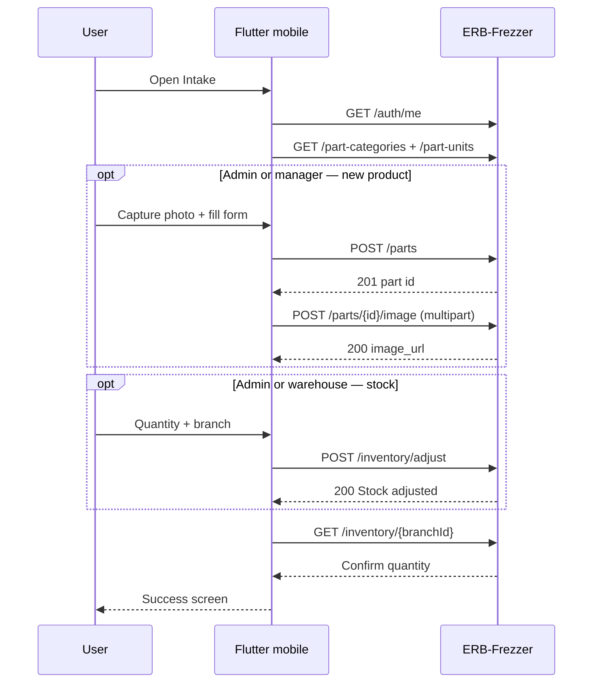
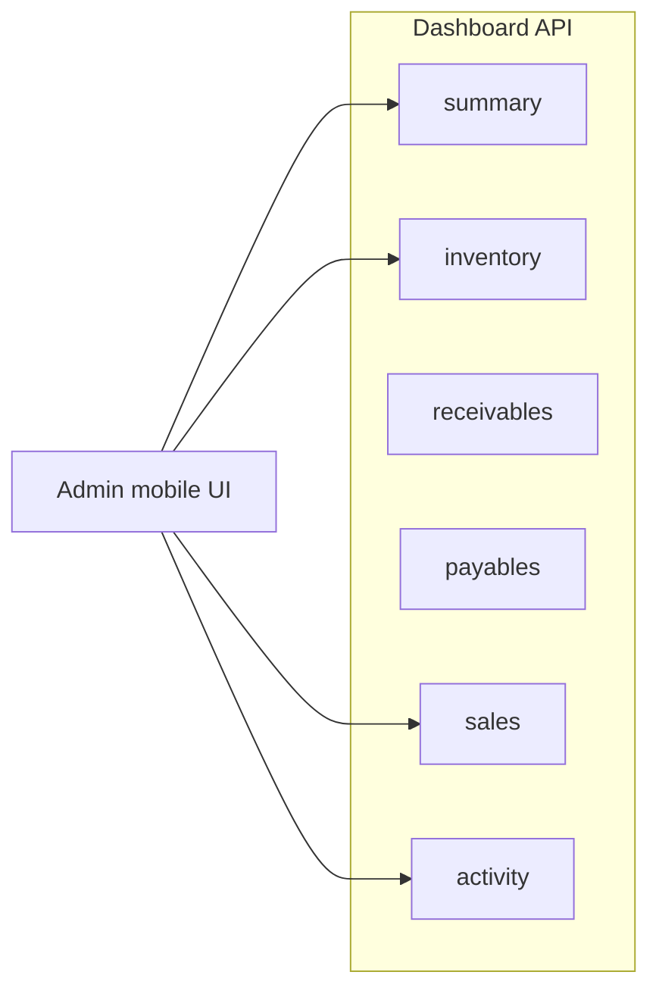

# Flutter mobile — Inventory intake + admin dashboard

Developer guide for a **Flutter mobile** app (Android / iOS) with **two experiences**:

1. **Admin** — dashboard (money in/out, KPIs, system activity) **plus** optional inventory intake.  
2. **Every other role** (`manager`, `warehouse`, `salesperson`, …) — **inventory intake only**; **no dashboard tab**, no dashboard numbers, no activity feed.

**Backend:** ERB-Frezzer REST API (`/api/v1`)  
**Example production base:** `https://api.tppower.shop/api/v1`  
**Related docs:** [flutter-add-part.md](./flutter-add-part.md), [flutter-dashboard-transactions-guide.md](./flutter-dashboard-transactions-guide.md), [flutter-dev-updates-may-2026.md](./flutter-dev-updates-may-2026.md), [part-analysis-api.md](./part-analysis-api.md), [part-image-api.md](./part-image-api.md), [part-categories-units-api.md](./part-categories-units-api.md), [flutter-windows-pos-offline-guide.md](./flutter-windows-pos-offline-guide.md)

---

## 1. Product goal

| Step | User action | Server effect |
|------|-------------|---------------|
| 1 | Take or pick a photo of the item | (local file only) |
| 2 | Enter / scan code, name, category, prices | `POST /parts` → new row in `parts` |
| 3 | Upload photo | `POST /parts/{id}/image` → public `image_url` |
| 4 | Enter quantity for a branch | `POST /inventory/adjust` → `stock` + `stock_movements` |

After success, the part appears in `GET /inventory/{branchId}` and can be sold on the Windows POS after its catalog sync.

**This flow requires internet.** The API does not accept offline part creation or stock uploads (unlike POS invoice queuing on Windows).

---

## 2. Two app experiences (product rule)

After `POST /auth/login`, read `user.role` from the response (or `GET /auth/me`). Branch the UI **once** — do not show dashboard UI to non-admins even if they could call the API.

```dart
bool get isAdmin => currentUser.role == 'admin';

Widget buildHome() {
  if (isAdmin) {
    return const AdminAppShell(); // Dashboard tab + optional Intake tab
  }
  return const InventoryOnlyShell(); // No dashboard — intake screens only
}
```

### 2.1 Admin only — dashboard tab

| What admin sees | API |
|-----------------|-----|
| **Money in today** (sales) | `GET /reports/financial?from={today}&to={today}` → `totals.net_sales` or `totals.profit` |
| **Money out today** (supplier payments) | Same request → `suppliers.payments_in_period` |
| **Weekly KPIs** (stock value, debt, receivables) | `GET /dashboard/summary` |
| **System activity** (last 20 events) | `GET /dashboard/activity` |
| Low stock, receivables, payables (optional sub-screens) | `GET /dashboard/inventory`, `/receivables`, `/payables` |

**Today’s date** (device local or server TZ — pick one and document it):

```dart
final today = DateFormat('yyyy-MM-dd').format(DateTime.now());
final report = await dio.get('/reports/financial', queryParameters: {
  'from': today,
  'to': today,
  if (branchId != null) 'branch_id': branchId,
});
final moneyIn = report.data['totals']['net_sales'];       // cash + credit sales today
final moneyOut = report.data['suppliers']['payments_in_period']; // installments paid today
```

| UI label (admin) | Field | Meaning |
|------------------|-------|---------|
| Received today | `totals.net_sales` | Invoice totals today (before refunds subtracted in net_sales calc) |
| Profit today | `totals.profit` | After discount & customer refunds today |
| Spent today | `suppliers.payments_in_period` | Supplier installment payments with `paid_at` today |
| Refunds today | `totals.customer_refunds` | Approved customer refunds today |

`GET /dashboard/summary` uses **this calendar week** for `weekly_*` fields — use it for weekly cards, **not** for “today” unless you only show week-to-date on purpose.

### 2.2 Everyone except admin — inventory only

| Rule | Implementation |
|------|----------------|
| No **Dashboard** tab | Hide bottom nav item / route |
| No calls to `/dashboard/*` in normal flow | Saves bandwidth; avoids leaking KPIs on shared phones |
| Home screen = **Inventory** | Title bar: “Inventory” — buttons below |
| No activity feed | `GET /dashboard/activity` — admin only in UI |

What each **non-admin** role can do **inside** the inventory shell (API still enforces 403):

| `user.role` | New item (photo + create part) | Add stock to existing |
|-------------|-------------------------------|------------------------|
| `manager` | Yes | No — show “Warehouse will add quantity” |
| `warehouse` | No | Yes |
| `salesperson` | No | No — show “Sales use Windows POS; inventory use warehouse account” |
| `admin` | Yes (also has dashboard) | Yes |

So: **one mobile app**, two shells. Only **`admin`** sees dashboard + today’s money + activity. **All other roles** land on inventory screens only, with buttons enabled per table above.

### 2.3 Navigation comparison

```
ADMIN LOGIN                          NON-ADMIN LOGIN
────────────────                     ─────────────────
[ Dashboard ] [ Inventory ]          (no second tab — inventory is the app)
     │                                    │
     ├─ Today in / out                    ├─ [ New item ]     (if manager/admin)
     ├─ Weekly summary                    ├─ [ Add stock ]    (if warehouse/admin)
     ├─ Activity feed                     └─ Success → scan another
     └─ Low stock / payables
```

### 2.4 API permissions (backend — still enforce)

The server does **not** hide `/dashboard/*` by role today; the **Flutter app must hide** those screens for non-admin. API write permissions unchanged:

| Action | Endpoint | Allowed roles |
|--------|----------|---------------|
| Login | `POST /auth/login` | Any active user |
| Dashboard / activity | `GET /dashboard/*` | Any authenticated (UI: **admin only**) |
| List categories / units | `GET /part-categories`, `GET /part-units` | Any authenticated |
| Search parts | `GET /parts?search=` | Any authenticated |
| **Create part** | `POST /parts` | **admin**, **manager** |
| **Upload image** | `POST /parts/{id}/image` | **admin**, **manager** |
| **Adjust stock** | `POST /inventory/adjust` | **admin**, **warehouse** |
| List branches | `GET /branches/active` | Any authenticated |

Check after login:

```http
GET /api/v1/auth/me
Authorization: Bearer <token>
```

```json
{
  "id": "uuid",
  "name": "Warehouse User",
  "email": "wh@example.com",
  "role": "warehouse",
  "branch_id": "branch-uuid",
  "is_active": true,
  "can_select_branch": false,
  "accessible_branch_ids": ["branch-uuid"],
  "branch": { "id": "branch-uuid", "name": "Main Store" }
}
```

- `can_select_branch: true` → admin (or user with no `branch_id`): show branch picker for stock.
- `can_select_branch: false` → lock stock to `branch_id` / `accessible_branch_ids[0]`.

---

## 3. End-to-end flow



### Screen map (suggested)

**Non-admin (inventory only):**

```
Login → Inventory Home
          ├── [New item]   → Camera → Details → Review → Submit   (manager, admin)
          └── [Add stock]  → Search → Quantity → Confirm           (warehouse, admin)
        Success → part card + [Scan another]
```

**Admin (dashboard + inventory):**

```
Login → Bottom nav
          [ Dashboard ]  → Today in/out, weekly summary, activity (§21)
          [ Inventory ]  → Same as non-admin home
        Success → part card + [View analysis] + [Scan another]
```

---

## 4. Authentication

### Login

```http
POST /api/v1/auth/login
Content-Type: application/json
Accept: application/json

{
  "email": "user@example.com",
  "password": "secret"
}
```

**Success `200`:**

```json
{
  "token": "eyJ...",
  "token_type": "Bearer",
  "expires_in": null,
  "user": {
    "id": "uuid",
    "role": "admin",
    "branch_id": null,
    "can_select_branch": true
  }
}
```

Store `token` in **flutter_secure_storage**. Attach to every request:

`Authorization: Bearer <token>`

### Logout

```http
POST /api/v1/auth/logout
```

### Dio base setup

```dart
final dio = Dio(BaseOptions(
  baseUrl: '$apiHost/api/v1',
  connectTimeout: const Duration(seconds: 30),
  receiveTimeout: const Duration(seconds: 60),
  headers: {'Accept': 'application/json'},
));

dio.interceptors.add(InterceptorsWrapper(
  onRequest: (options, handler) async {
    final token = await secureStorage.read(key: 'access_token');
    if (token != null) {
      options.headers['Authorization'] = 'Bearer $token';
    }
    handler.next(options);
  },
  onError: (error, handler) async {
    if (error.response?.statusCode == 401) {
      // Navigate to login, clear token
    }
    handler.next(error);
  },
));
```

---

## 5. Step A — Capture photo (client only)

Use the device camera or gallery. The server never receives the raw photo until **after** the part exists.

### Suggested packages

| Package | Use |
|---------|-----|
| `image_picker` | Camera / gallery |
| `permission_handler` | Camera & photos permissions |
| `flutter_image_compress` | Resize/compress before upload (stay under 2 MB) |
| `mobile_scanner` or `flutter_barcode_scanner` | Optional: fill `code` from barcode |

### Client rules (before upload)

| Rule | Limit |
|------|--------|
| Max upload size | **2 MB** (`max:2048` KB on server) |
| MIME types | JPEG, PNG, WebP only |
| Field name | `image` (multipart) |

### Compress example

Target ~1200 px max edge and JPEG quality ~85 so warehouse photos stay under 2 MB.

```dart
import 'dart:io';
import 'package:flutter_image_compress/flutter_image_compress.dart';
import 'package:path_provider/path_provider.dart';

Future<File> preparePartPhoto(File original) async {
  final dir = await getTemporaryDirectory();
  final target = File('${dir.path}/part_${DateTime.now().millisecondsSinceEpoch}.jpg');

  final result = await FlutterImageCompress.compressAndGetFile(
    original.absolute.path,
    target.absolute.path,
    quality: 85,
    minWidth: 1200,
    minHeight: 1200,
    format: CompressFormat.jpeg,
  );

  if (result == null) throw Exception('Image compression failed');

  final file = File(result.path);
  if (await file.length() > 2 * 1024 * 1024) {
    throw Exception('Image still over 2 MB — retake or lower quality');
  }
  return file;
}
```

Keep the compressed `File` in memory / temp path for the upload step after `POST /parts`.

---

## 6. Step B — Load form metadata

Call once when opening the “New item” wizard (cache in memory for the session).

### Categories

```http
GET /api/v1/part-categories
```

Response: **JSON array** (no wrapper).

```json
[
  {
    "id": "uuid",
    "key": "compressor",
    "name": "Compressor",
    "sort_order": 1,
    "is_active": true
  }
]
```

Default keys from seeder: `compressor`, `evaporator`, `fan_motor`, `controls`, `electrical`, `refrigerant`, `seals`.

Submit **`category_key`** (stable) rather than only display name.

### Units

```http
GET /api/v1/part-units
```

```json
{
  "units": [
    { "value": "pc", "label": "Piece" },
    { "value": "kg", "label": "Kilogram" }
  ]
}
```

Submit `unit` as the **`value`** (`pc`, `box`, `set`, `kg`, `m`, `l`, `roll`, `pack`).

### Branches (for stock step)

```http
GET /api/v1/branches/active
```

Use for branch dropdown when `can_select_branch == true`.

---

## 7. Step C — Avoid duplicates (search first)

Before creating a part, search by label on the box or barcode:

```http
GET /api/v1/parts?search=BRK-001&per_page=10
```

Paginated Laravel shape:

```json
{
  "data": [
    {
      "id": "uuid",
      "code": "BRK-001",
      "name": "Brake pad",
      "image_url": "https://.../storage/parts/uuid.jpg"
    }
  ],
  "meta": { "current_page": 1, "last_page": 1, "per_page": 10, "total": 1 }
}
```

**UX:** If matches exist, offer **“Add stock to existing”** instead of create (warehouse-friendly).

---

## 8. Step D — Create the part

**Roles:** admin, manager only.

```http
POST /api/v1/parts
Content-Type: application/json
Authorization: Bearer <token>

{
  "code": "INTAKE-20260604-001",
  "name": "Danfoss compressor 1/3 HP",
  "category_key": "compressor",
  "unit": "pc",
  "sell_price": 1500,
  "cost_price": 1100,
  "min_stock": 2,
  "is_active": true
}
```

| Field | Validation | Notes |
|-------|------------|-------|
| `code` | Required, unique, max 64 | Use barcode, supplier SKU, or generated `INTAKE-{date}-{seq}` |
| `name` | Required, max 255 | From label or user typing |
| `category_key` *or* `category_id` | One required | Prefer `category_key` |
| `unit` | Required enum | From `/part-units` |
| `sell_price`, `cost_price` | Number ≥ 0 | Required even for warehouse intake |
| `min_stock` | Integer ≥ 0 | Low-stock alert threshold |
| `is_active` | Optional | Default `true` |

**Success `201`:** save `id` from body for image + stock steps.

```json
{
  "id": "019e30c6-xxxx-xxxx-xxxx-xxxxxxxxxxxx",
  "code": "INTAKE-20260604-001",
  "name": "Danfoss compressor 1/3 HP",
  "category_key": "compressor",
  "unit": "pc",
  "unit_label": "Piece",
  "sell_price": 1500,
  "cost_price": 1100,
  "min_stock": 2,
  "is_active": true,
  "image_url": null
}
```

### Common errors

| HTTP | Cause | App behavior |
|------|-------|--------------|
| `401` | Token expired | Login screen |
| `403` | Wrong role (e.g. warehouse) | Hide create UI; stock-only mode |
| `422` | Validation | Map `errors` to fields |
| `422` on `code` | Duplicate code | Suggest search or edit code |

---

## 9. Step E — Upload photo

**Roles:** admin, manager. **Requires part `id` from step D.**

```http
POST /api/v1/parts/{id}/image
Content-Type: multipart/form-data
Authorization: Bearer <token>

image: <file>
```

### Dio (mobile file path)

```dart
Future<Map<String, dynamic>> uploadPartImage(String partId, File imageFile) async {
  final formData = FormData.fromMap({
    'image': await MultipartFile.fromFile(
      imageFile.path,
      filename: 'part.jpg',
      contentType: DioMediaType('image', 'jpeg'),
    ),
  });

  final response = await dio.post(
    '/parts/$partId/image',
    data: formData,
    options: Options(contentType: 'multipart/form-data'),
  );
  return response.data as Map<String, dynamic>;
}
```

**Success `200`:** body is full part resource; use `image_url` in UI (`Image.network`).

Re-upload **replaces** the previous file. Remove with `DELETE /parts/{id}/image` (admin/manager).

**Order:** Always `POST /parts` first, then image. Upload fails if part id is missing.

---

## 10. Step F — Add inventory quantity

**Roles:** admin, warehouse only (**not** manager).

New parts start at **quantity 0** until adjusted.

```http
POST /api/v1/inventory/adjust
Content-Type: application/json
Authorization: Bearer <token>

{
  "part_id": "019e30c6-xxxx-xxxx-xxxx-xxxxxxxxxxxx",
  "branch_id": "branch-uuid",
  "quantity_delta": 12,
  "reason": "Mobile intake — shelf A3"
}
```

| Field | Rules |
|-------|--------|
| `part_id` | UUID from create (or search) |
| `branch_id` | User’s branch, or selected if admin |
| `quantity_delta` | Non-zero integer; **positive** to add stock |
| `reason` | Optional, max 1000 chars (audit / movement notes) |

**Success `200`:**

```json
{ "message": "Stock adjusted." }
```

Server creates/updates `stock` row and a `stock_movements` record (`movement_type: adjustment`). Dashboard cache is invalidated server-side.

### Verify

```http
GET /api/v1/inventory?part_id={partId}&branch_id={branchId}
```

Or list branch stock and filter client-side:

```http
GET /api/v1/inventory/{branchId}
```

Find the row where `part_id` matches and confirm `quantity`.

### Negative delta

`quantity_delta` may be negative (write-off / correction). Intake app normally sends positive values only.

---

## 11. Orchestration service (recommended)

Implement one **transactional client pipeline** with rollback messaging (server has no single “atomic” endpoint).

```dart
class IntakeResult {
  final String partId;
  final String? imageUrl;
  final int quantityAdded;
  final String branchId;
}

class InventoryIntakeService {
  InventoryIntakeService(this._dio);
  final Dio _dio;

  Future<IntakeResult> runNewItemPipeline({
    required PartFormData form,
    required File? photo,
    required String branchId,
    required int quantity,
    String? stockReason,
  }) async {
    // 1) Create part
    final createRes = await _dio.post('/parts', data: form.toJson());
    final partId = createRes.data['id'] as String;

    // 2) Image (optional but recommended)
    String? imageUrl;
    if (photo != null) {
      try {
        final uploaded = await uploadPartImage(partId, photo);
        imageUrl = uploaded['image_url'] as String?;
      } catch (e) {
        // Part exists without photo — show warning + offer retry upload
      }
    }

    // 3) Stock
    await _dio.post('/inventory/adjust', data: {
      'part_id': partId,
      'branch_id': branchId,
      'quantity_delta': quantity,
      if (stockReason != null) 'reason': stockReason,
    });

    return IntakeResult(
      partId: partId,
      imageUrl: imageUrl,
      quantityAdded: quantity,
      branchId: branchId,
    );
  }
}
```

### Failure handling

| Failed step | Server state | User message |
|-------------|--------------|--------------|
| Create | Nothing | Fix form and retry |
| Image | Part exists, no image | “Part saved; tap to retry photo” → `POST .../image` |
| Stock | Part (+ maybe image) exists, qty 0 | “Retry add stock” → `POST /inventory/adjust` only |

Do **not** delete the part automatically on partial failure.

---

## 12. UI specification

### 12.1 New item wizard

| Screen | Fields / actions |
|--------|------------------|
| **Camera** | Capture / retake / skip photo (manager may skip but encourage photo) |
| **Details** | Code*, Name*, Category*, Unit*, Cost*, Sell*, Min stock* |
| **Stock** | Branch (if allowed), Quantity*, Reason (optional) |
| **Review** | Thumbnail, summary, [Submit] |
| **Done** | `image_url`, code, quantity; [Add another] |

\*Required for create. Stock screen hidden for `manager` unless you only queue catalog (see §2).

### 12.2 Add stock to existing

| Screen | Actions |
|--------|---------|
| **Search** | `GET /parts?search=` debounced |
| **Pick part** | Show `image_url`, code, name |
| **Quantity** | Branch + delta + reason |
| **Done** | Confirm via `GET /inventory/{branchId}` |

### 12.3 Connectivity banner

When offline: disable submit; message **“Connect to internet to add products or stock.”**

Optional: save **draft** JSON locally (photo path + form) for retry when online — **not** synced by API; app-owned only.

---

## 13. Suggested Flutter project layout

```
lib/
  main.dart
  config/
    api_config.dart          # base URL per flavor (dev/prod)
  core/
    api/
      dio_client.dart
      auth_interceptor.dart
    storage/
      secure_token_store.dart
  features/
    auth/
      login_screen.dart
    intake/
      intake_home_screen.dart
      camera_capture_screen.dart
      part_details_form.dart
      stock_entry_screen.dart
      intake_review_screen.dart
      intake_success_screen.dart
      existing_part_stock_screen.dart
    intake/data/
      intake_api.dart
      inventory_intake_service.dart
      models/
        part_form_data.dart
        category_option.dart
        unit_option.dart
```

### `pubspec.yaml` dependencies (starter)

```yaml
dependencies:
  flutter:
    sdk: flutter
  dio: ^5.7.0
  flutter_secure_storage: ^9.2.2
  image_picker: ^1.1.2
  flutter_image_compress: ^2.3.0
  path_provider: ^2.1.4
  permission_handler: ^11.3.1
  # optional:
  mobile_scanner: ^6.0.2
```

---

## 14. Permissions matrix (copy for QA)

### App shell (UI)

| `user.role` | Dashboard tab | Inventory home | Activity feed |
|-------------|---------------|----------------|---------------|
| **admin** | **Yes** | Yes | Yes |
| manager | **No** | Yes | **No** |
| warehouse | **No** | Yes | **No** |
| salesperson | **No** | Yes (limited actions) | **No** |

### Inventory actions (API)

| `user.role` | New item wizard | Upload image | Adjust stock |
|-------------|-----------------|--------------|--------------|
| admin | Yes | Yes | Yes |
| manager | Yes | Yes | **No** |
| warehouse | **No** | **No** | Yes |
| salesperson | **No** | **No** | **No** |

---

## 15. Security & operations

- Use **HTTPS** only in production.
- Do not log passwords or tokens.
- Rotate intake device accounts; prefer per-branch **warehouse** + one **admin** override.
- Large photos: always compress client-side (§5).
- `image_url` is public HTTP(S) under `/storage/parts/` — suitable for catalog thumbnails.

---

## 16. Testing checklist

### Manual API (Postman)

Collection: `postman/ERB-Frezzer-API.postman_collection.json` → folder **Parts**, **Inventory**.

### Mobile QA

- [ ] Login as **admin** — full pipeline succeeds  
- [ ] Login as **manager** — create + image OK; stock step blocked or delegated  
- [ ] Login as **warehouse** — search + stock only; create returns 403  
- [ ] Duplicate `code` shows friendly error  
- [ ] Image > 2 MB rejected before upload  
- [ ] Image upload retry after part created  
- [ ] Stock retry after part created without stock  
- [ ] `GET /inventory/{branchId}` shows new quantity  
- [ ] Airplane mode — submit disabled with clear message  
- [ ] Token expiry returns to login  

### Backend regression

From repo root:

```bash
php artisan test --filter=PartImageTest
php artisan test --filter=FrostpartsFlowTest
```

---

## 17. API quick reference

### Intake

| Method | Path | Purpose |
|--------|------|---------|
| `POST` | `/auth/login` | Get token |
| `GET` | `/auth/me` | Role + branch |
| `GET` | `/part-categories` | Category dropdown |
| `GET` | `/part-units` | Unit dropdown |
| `GET` | `/parts?search=` | Duplicate check |
| `POST` | `/parts` | Create part |
| `POST` | `/parts/{id}/image` | Upload photo |
| `GET` | `/branches/active` | Branch picker |
| `POST` | `/inventory/adjust` | Add quantity |
| `GET` | `/inventory?part_id=&branch_id=` | Verify stock |
| `GET` | `/inventory/{branchId}` | Branch stock list |

### Admin oversight (§21)

| Method | Path | Purpose |
|--------|------|---------|
| `GET` | `/dashboard/summary` | KPI cards |
| `GET` | `/dashboard/sales` | Weekly sales breakdown |
| `GET` | `/dashboard/inventory` | Stock rows + low flag |
| `GET` | `/dashboard/receivables` | Credit customers |
| `GET` | `/dashboard/payables` | Supplier installments |
| `GET` | `/dashboard/activity` | Last 20 audit events |
| `GET` | `/parts/{id}/analysis` | Single-part metrics |
| `GET` | `/reports/financial?from=&to=` | Period P&amp;L |

---

## 18. Difference vs Windows POS app

| Topic | Windows POS | Mobile intake |
|-------|-------------|---------------|
| Platform | Desktop | Phone / tablet |
| Offline sales queue | Yes (`pending_invoices`) | **No** |
| Primary task | Sell invoices | Catalog + stock capture |
| Camera | File picker | Camera-first |
| Part create | Settings / Parts screen | Wizard optimized for warehouse |

After intake, Windows clients should refresh catalog (`GET /inventory/{branchId}`) when online so new SKUs appear in POS search.

---

## 19. Optional enhancements (app-side)

| Feature | Notes |
|---------|--------|
| Barcode → `code` | Reduces typos; still check duplicates via search |
| OCR label → `name` | On-device ML; not in API |
| Batch intake session | Queue multiple items locally, POST sequentially |
| Print label | Out of scope for API; integrate later |
| `PUT /parts/{id}` | Edit prices/name after create if mistake |

---

## 20. Support contacts for API changes

If the business needs **one-shot** “create + image + stock” in a single request, that would be a **new backend endpoint** — not available today. Until then, use the pipeline in §11.

---

## 21. Admin only — dashboard, activity, analysis

**§2 is the product rule:** only `user.role == 'admin'` gets this module. Managers, warehouse, and salespeople use **inventory-only** shell (§2.2) — do not mount dashboard routes in their navigator.

All dashboard routes require authentication only (no extra `role:` on the server). **Hide in Flutter** for non-admin so KPIs are not shown on warehouse phones.

**Full field dictionary and money flows:** [flutter-dashboard-transactions-guide.md](./flutter-dashboard-transactions-guide.md).

### 21.1 Who sees what on mobile (final)

| Screen | admin | manager | warehouse | salesperson |
|--------|-------|---------|-----------|-------------|
| Dashboard tab | **Yes** | **No** | **No** | **No** |
| Today money in / out | **Yes** | **No** | **No** | **No** |
| Activity feed | **Yes** | **No** | **No** | **No** |
| Inventory home | Yes | Yes | Yes | Yes (no actions) |
| Part analysis | Yes | No | No | No |
| Financial report | Yes | No | No | No |

---

### 21.2 Dashboard endpoints

Base: `GET /api/v1/dashboard/{endpoint}`



| Endpoint | Use on mobile |
|----------|----------------|
| `GET /dashboard/summary` | Home KPI cards (pull-to-refresh) |
| `GET /dashboard/activity` | “Recent activity” list |
| `GET /dashboard/inventory` | Low-stock highlights |
| `GET /dashboard/receivables` | Who owes money |
| `GET /dashboard/payables` | Supplier installments due / overdue |
| `GET /dashboard/sales` | Weekly profit by branch / category |

Optional query on **summary** and **sales**:

```http
GET /api/v1/dashboard/summary?branch_id={uuid}
GET /api/v1/dashboard/sales?branch_id={uuid}
```

Only **admin** should send `branch_id`; branch users are scoped server-side via `BranchVisibility`.

---

### 21.3 Today — money in & money out (admin dashboard home)

Use **financial report** for the **selected calendar day** (usually today):

```http
GET /api/v1/reports/financial?from=2026-06-04&to=2026-06-04
Authorization: Bearer <admin token>
```

Optional: `branch_id={uuid}` to filter one branch.

```json
{
  "period": { "from": "2026-06-04", "to": "2026-06-04", "branch_id": null },
  "totals": {
    "revenue": 5000,
    "discount": 200,
    "customer_refunds": 0,
    "net_sales": 4800,
    "gross_profit": 2100,
    "profit": 1900
  },
  "suppliers": {
    "payments_in_period": 25000,
    "purchases_ordered_in_period": 0,
    "purchases_received_in_period": 0
  }
}
```

| Admin card | JSON path | User-facing label (example) |
|------------|-----------|----------------------------|
| Money in | `totals.net_sales` | “Received today” |
| Profit | `totals.profit` | “Profit today” |
| Money out | `suppliers.payments_in_period` | “Paid suppliers today” |
| Refunds | `totals.customer_refunds` | “Refunds today” |

Credit collections (`POST /settlements`) are **not** in `net_sales` the same way as cash invoices — if you need “cash collected from credit customers today”, add a follow-up API or sum settlements client-side from a future endpoint. For v1, label `net_sales` clearly as **sales today**.

Pull-to-refresh: call **both** `reports/financial` (today) and `dashboard/summary` (weekly).

### 21.4 Summary — KPI fields (`GET /dashboard/summary`)

Example response:

```json
{
  "total_receivables": 12500,
  "total_supplier_debt": 75000,
  "total_stock_value_cost": 320000,
  "business_capital": 500000,
  "capital_currency": "EGP",
  "capital_estimated_available": 180000,
  "weekly_revenue": 2400,
  "weekly_discount": 200,
  "weekly_customer_refunds": 120,
  "weekly_net_sales": 2080,
  "weekly_gross_profit": 700,
  "weekly_profit": 580,
  "weekly_supplier_payments": 25000,
  "weekly_purchases_ordered": 100000,
  "weekly_purchases_received": 100000,
  "unpaid_installments_total": 75000,
  "overdue_installments_total": 0,
  "unpaid_installments_count": 3
}
```

#### Mobile card layout (suggested)

| Card | Field(s) | Label hint |
|------|----------|------------|
| Stock value | `total_stock_value_cost` | Inventory at cost |
| Weekly profit | `weekly_profit` | Not the same as `weekly_revenue` |
| Receivables | `total_receivables` | Credit customers owe you |
| Supplier debt | `total_supplier_debt` | You owe suppliers |
| Capital | `business_capital`, `capital_currency` | From Settings |
| Refunds | `weekly_customer_refunds` | This week |
| Purchases | `weekly_purchases_ordered`, `weekly_purchases_received` | PO activity |
| Installments | `unpaid_installments_total`, `unpaid_installments_count` | Tap → payables screen |

**After mobile intake (stock adjust):**

| Field | Changes? |
|-------|----------|
| `total_stock_value_cost` | **Yes** — increases by `quantity × cost_price` |
| `weekly_revenue`, `weekly_profit` | **No** — until someone sells the part |
| `total_supplier_debt` | **No** — unless linked to a purchase |

Server caches summary up to **5 minutes** (`DashboardQueryService` TTL). Intake calls `forgetAllSummaries()` on adjust, but pull-to-refresh is still recommended.

---

### 21.5 Sales breakdown (`GET /dashboard/sales`)

```json
{
  "totals": {
    "revenue": 2400,
    "discount": 200,
    "customer_refunds": 120,
    "net_sales": 2080,
    "gross_profit": 700,
    "profit": 580
  },
  "by_category": [
    { "category_key": "compressor", "category": "Compressor", "total": 1200 }
  ],
  "by_branch": [
    {
      "branch_id": "uuid",
      "name": "Main",
      "total": 2080,
      "revenue": 2400,
      "discount": 200,
      "customer_refunds": 120,
      "profit": 580
    }
  ],
  "credit_vs_cash": [
    { "payment_type": "cash", "total": 1800 },
    { "payment_type": "credit", "total": 600 }
  ]
}
```

Use **`totals.profit`** for the headline number, not `totals.revenue`.

---

### 21.6 Inventory widget (`GET /dashboard/inventory`)

Array of rows (all stock lines):

```json
[
  {
    "part_id": "uuid",
    "part_code": "INTAKE-20260604-001",
    "branch_id": "uuid",
    "branch_name": "Main Store",
    "quantity": 12,
    "min_stock": 2,
    "low": false
  }
]
```

**Mobile UX:**

- Filter `low == true` for a “Low stock” section.
- After intake success, open this list filtered by `part_code` to confirm the new line appears.
- Tap row → `GET /parts/{part_id}/analysis`.

---

### 21.7 Receivables & payables

**Receivables** — `GET /dashboard/receivables`

```json
[
  {
    "customer_id": "uuid",
    "name": "Shop ABC",
    "outstanding_balance": 5000,
    "unpaid_invoices": 3
  }
]
```

**Payables** — `GET /dashboard/payables`

```json
{
  "upcoming_30_days": [ /* SupplierInstallment objects */ ],
  "overdue": [ /* SupplierInstallment objects */ ]
}
```

Not affected by mobile intake directly; show on admin home for cash-flow awareness.

---

### 21.8 Activity feed (`GET /dashboard/activity`)

Returns the **latest 20** rows from `audit_logs` (newest first). **No pagination** today.

```json
[
  {
    "id": "uuid",
    "user_id": "uuid",
    "action": "inventory.adjust",
    "entity_type": "stock",
    "entity_id": "part-uuid|branch-uuid",
    "old_value": { "stock": "adjusted" },
    "new_value": {
      "part_id": "part-uuid",
      "branch_id": "branch-uuid",
      "quantity_delta": 12,
      "reason": "Mobile intake — shelf A3"
    },
    "ip_address": "192.168.1.10",
    "created_at": "2026-06-04T14:30:00.000000Z"
  }
]
```

#### Common `action` values (map to UI labels)

| `action` | Meaning |
|----------|---------|
| `inventory.adjust` | Manual stock change (**mobile intake**) |
| `invoice.create` | Sale |
| `invoice.cancel` | Void sale |
| `purchase_order.create` | New PO |
| `installment.pay` | Supplier payment |
| `return.approve` | Customer return approved |
| `settlement.create` | Credit collection |
| `transfer.complete` | Branch transfer received |
| `branch_finance.charge` | Inter-branch charge |

**Note:** `POST /parts` (create part) does **not** write an audit row today. After intake you will see **`inventory.adjust`** in activity, not “part created”. Use part search or dashboard inventory to confirm new SKUs.

#### Flutter: display row

```dart
String activityTitle(Map<String, dynamic> row) {
  switch (row['action']) {
    case 'inventory.adjust':
      final nv = row['new_value'] as Map<String, dynamic>?;
      final delta = nv?['quantity_delta'];
      return 'Stock adjusted ${delta != null ? (delta >= 0 ? '+' : '') + '$delta' : ''}';
    case 'invoice.create':
      return 'Invoice created';
    case 'installment.pay':
      return 'Supplier installment paid';
    default:
      return row['action']?.toString() ?? 'Activity';
  }
}
```

Resolve `user_id` to a name via a cached `GET /users` list (admin) or show id only.

---

### 21.9 Part analysis (`GET /parts/{id}/analysis`)

Use after intake on the **success screen** or from dashboard inventory tap.

```http
GET /api/v1/parts/{partId}/analysis?from=2026-06-01&to=2026-06-30&branch_id={uuid}
```

Shows stock snapshot, sales, purchases, returns, **movements** (includes `adjustment` from mobile intake), and `sales_by_month` chart data.

**Intake-only part (no sales yet):**

- `sales.units_sold` → 0  
- `inventory.total_quantity` → quantity you added  
- `movements.by_type` may include `{ "movement_type": "adjustment", "quantity": 12 }`  

Full schema: [part-analysis-api.md](./part-analysis-api.md).

```dart
Future<Map<String, dynamic>> loadPartAnalysis(
  String partId, {
  String? from,
  String? to,
  String? branchId,
}) async {
  final response = await dio.get(
    '/parts/$partId/analysis',
    queryParameters: {
      if (from != null) 'from': from,
      if (to != null) 'to': to,
      if (branchId != null) 'branch_id': branchId,
    },
  );
  return response.data as Map<String, dynamic>;
}
```

---

### 21.10 Period report (`GET /reports/financial`)

For admin “Reports” tab (month range P&amp;L):

```http
GET /api/v1/reports/financial?from=2026-06-01&to=2026-06-30&branch_id={uuid}
```

Same `totals` shape as `dashboard/sales` totals. Returns do not include brand-new parts until they are sold or returned.

See [flutter-dev-updates-may-2026.md](./flutter-dev-updates-may-2026.md) §2.

---

### 21.11 Refresh rules (mobile)

| Event | Call |
|-------|------|
| App open (admin home) | `GET /dashboard/summary`, `GET /dashboard/activity` |
| Pull-to-refresh | Same |
| After successful intake (admin watching) | `summary` + `inventory` + `activity` |
| Tap “Analysis” on part | `GET /parts/{id}/analysis` |
| After invoice / PO / settlement (if app also sells) | `summary` — see [flutter-dashboard-transactions-guide.md](./flutter-dashboard-transactions-guide.md) §1 |

```dart
class DashboardRepository {
  DashboardRepository(this._dio);
  final Dio _dio;

  Future<Map<String, dynamic>> summary({String? branchId}) async {
    final res = await _dio.get(
      '/dashboard/summary',
      queryParameters: branchId != null ? {'branch_id': branchId} : null,
    );
    return res.data as Map<String, dynamic>;
  }

  Future<List<dynamic>> activity() async {
    final res = await _dio.get('/dashboard/activity');
    return res.data as List<dynamic>;
  }

  Future<List<dynamic>> inventoryRows() async {
    final res = await _dio.get('/dashboard/inventory');
    return res.data as List<dynamic>;
  }
}
```

---

### 21.12 Admin home UI (wireframe)

```
┌─────────────────────────────────────┐
│  FrostParts Admin          [Profile]│
│  Branch: [ All ▼ ]                  │
├─────────────────────────────────────┤
│  Stock value      Weekly profit     │
│  320,000 EGP      580 EGP           │
│  Receivables      Supplier debt     │
│  12,500           75,000            │
├─────────────────────────────────────┤
│  Recent activity                    │
│  • Stock adjusted +12  2m ago       │
│  • Invoice created     15m ago      │
│  • Installment paid    1h ago       │
├─────────────────────────────────────┤
│  Low stock (3)          [See all]   │
│  • BRK-001  Main  qty 1 / min 5     │
├─────────────────────────────────────┤
│ [ Dashboard ]  [ Inventory ]        │
└─────────────────────────────────────┘
```

Bottom nav (**admin only**): **Dashboard** (this section) + **Inventory** (§12). Non-admin: no bottom nav — single Inventory home.

---

### 21.13 QA — dashboard & activity

- [ ] Admin `summary` loads; `total_stock_value_cost` increases after intake with cost × qty  
- [ ] `activity` shows `inventory.adjust` with correct `quantity_delta` and `reason`  
- [ ] `dashboard/inventory` lists new `part_code` with correct `quantity`  
- [ ] `parts/{id}/analysis` shows `adjustment` movement  
- [ ] `weekly_profit` unchanged right after intake (no sale yet)  
- [ ] Branch filter on summary (admin only) narrows `weekly_*` metrics  
- [ ] Pull-to-refresh after intake updates within seconds (cache bust on adjust)  

Backend regression:

```bash
php artisan test --filter=DashboardSupplierPaymentsTest
php artisan test --filter=DashboardDiscountProfitTest
php artisan test --filter=PartAnalysisTest
```

---

## 22. Related Windows / API docs

| Topic | Document |
|-------|----------|
| Every dashboard field + transaction recipes | [flutter-dashboard-transactions-guide.md](./flutter-dashboard-transactions-guide.md) |
| May 2026 API changes | [flutter-dev-updates-may-2026.md](./flutter-dev-updates-may-2026.md) |
| Part analysis schema | [part-analysis-api.md](./part-analysis-api.md) |
| Windows ERP (full) | [flutter-windows-recent-updates.md](./flutter-windows-recent-updates.md) |

---

## 23. Support contacts for API changes

If the business needs **one-shot** “create + image + stock” in a single request, that would be a **new backend endpoint** — not available today. Until then, use the pipeline in §11.

If **part create** should appear in `dashboard/activity`, that requires a backend change (`audit` on `POST /parts`).
