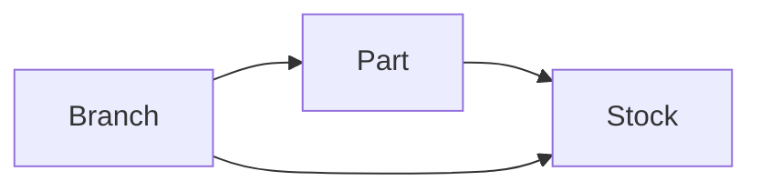

# Parts, branch & warehouse

**Audience:** Shop owner + Flutter (`erd_rezzer`) developers  
**Date:** June 2026

Each **part** belongs to **one branch**. The **warehouse** is the `stock` row (quantity) for that part in that branch.

---

## 1. Two tables — one product per branch



| Table | Role | Key fields |
|-------|------|------------|
| **`parts`** | Product definition (code, name, prices, min stock) | `branch_id`, `code`, `sell_price`, … |
| **`stock`** | Warehouse quantity for that part in that branch | `part_id`, `branch_id`, `quantity`, `average_cost` |

- **Branch A** can have part `COMP-001` with qty 50.
- **Branch B** can have its **own** part row also coded `COMP-001` with qty 10 — separate UUIDs.
- Part `code` is unique **per branch**, not globally.

---

## 2. Create part (API)

**Requires a branch** (from admin filter, user assignment, query, body, or header).

```http
POST /api/v1/parts?branch_id={branchUuid}
Authorization: Bearer <token>
Content-Type: application/json

{
  "code": "COMP-001",
  "name": "Compressor 1HP",
  "category_key": "compressor",
  "unit": "pc",
  "sell_price": 1200,
  "cost_price": 800,
  "min_stock": 5,
  "initial_quantity": 20
}
```

| Field | Required | Notes |
|-------|----------|--------|
| `branch_id` | Implicit | From `?branch_id=`, JSON body, or `X-Branch-Id` |
| `initial_quantity` | No | Opening warehouse qty (default 0). Creates/adjusts `stock`. |
| `code` | Yes | Unique **within the branch** |

**Response includes:**

```json
{
  "id": "uuid",
  "code": "COMP-001",
  "branch_id": "branch-uuid",
  "sell_price": 1200,
  ...
}
```

**Server automatically:**

1. Saves `parts.branch_id`
2. Creates `stock` row (`part_id` + `branch_id`, qty 0)
3. If `initial_quantity` > 0 → adjusts stock (opening stock movement)

---

## 3. List & warehouse

| Action | Endpoint |
|--------|----------|
| Parts catalog (branch) | `GET /parts?branch_id={uuid}` |
| Warehouse rows | `GET /inventory?branch_id={uuid}` |
| Warehouse for one branch | `GET /inventory/{branchId}?branch_id={uuid}` |
| Adjust qty later | `POST /inventory/adjust` |

Part list returns only parts where `parts.branch_id` matches the active branch filter.

---

## 4. Flutter changes

### Model

```dart
class Part {
  final String? branchId;
  // fromJson: json['branch_id']
}
```

### Add part screen

1. Require active branch (admin dropdown or user’s assigned branch).
2. POST with `queryParameters: branchQuery()`.
3. Optional field **Opening quantity** → `initial_quantity`.
4. After save, refresh **Parts** and **Inventory** for that branch.

### POS / sales

Only show parts from the **current branch** (`GET /parts?branch_id=`).

### Do not

- Create a part without a branch context (API returns error).
- Assume one global part catalog shared by all branches.

---

## 5. Related docs

- [flutter-add-part.md](./flutter-add-part.md) — form fields & image upload
- [flutter-admin-branch-filter.md](./flutter-admin-branch-filter.md) — branch dropdown on all screens

## 6. Tests

```bash
php artisan test --filter=PartBranchWarehouseTest
```
