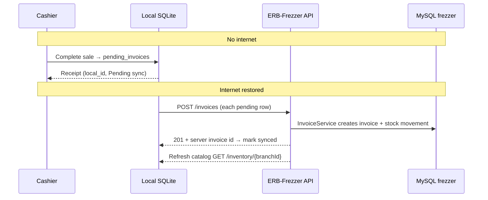
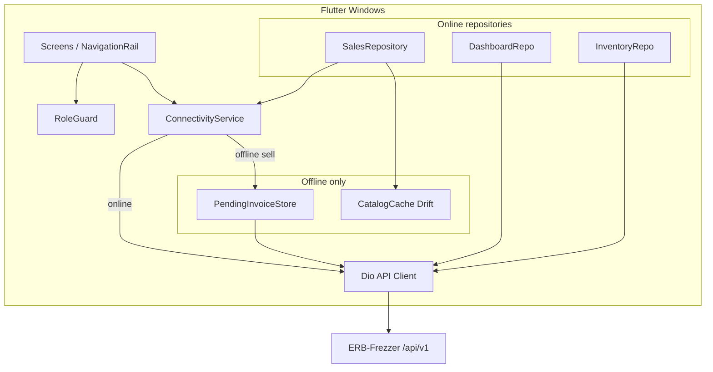

# FrostParts — Flutter Windows ERP App (full system)

Single **Flutter Windows** desktop client for the entire **ERB-Frezzer** API (`/api/v1`). All modules—sales, inventory, purchases, suppliers, settlements, returns, dashboard, and reports—live in one app.

---

## 0. Offline policy (read this first)

**The only data written locally and later saved to the server database is selling (invoices).**

| Data | On device when offline | Synced to MySQL? |
|------|------------------------|------------------|
| **New sale / invoice** | Yes — `pending_invoices` table | **Yes** — `POST /api/v1/invoices` when internet returns |
| Parts, stock, customers | Read-only copy for POS search | No — refreshed from API when online (not uploaded) |
| Purchases, transfers, settlements, returns, etc. | Not saved offline | N/A — **online only** |



**Do not** store purchases, transfers, customer edits, or any other module in local storage for later upload. If there is no connection, the user can **only** finish a sale; everything else waits until online.

---

## 1. Product scope

| Area | In Flutter app | Offline allowed |
|------|----------------|-----------------|
| Auth (login / session) | Yes | Resume last session only |
| Dashboard & KPIs | Yes | No |
| Branches (CRUD) | Yes (admin) | No |
| Parts catalog (CRUD) | Yes | No |
| Inventory & low stock | Yes | No (read-only cache for POS search only) |
| Stock transfers | Yes | No |
| Customers (CRUD) | Yes | No (read-only cache for POS picker only) |
| **Invoices / POS selling** | Yes | **Yes — only offline writes; sync to DB** |
| Saturday settlements | Yes | No |
| Suppliers & debt | Yes | No |
| Purchase orders & receive | Yes | No |
| Supplier installments | Yes | No |
| Product returns (approve/reject) | Yes | No |
| Reports (sales, inventory, …) | Yes | No |

**Offline rule:** When disconnected, show banner `Offline — only new sales can be saved locally`. Hide or disable all nav items except **POS / New sale**, **Pending sync**, and **Sales history (local)**.

---

## 2. Roles & navigation visibility

Backend roles (`user.role` from `/auth/me`):

| Role | Typical use |
|------|-------------|
| `admin` | Full access |
| `manager` | Operations, approvals, most writes |
| `salesperson` | Customers, invoices, returns (create) |
| `warehouse` | Inventory adjust, transfers, purchase receive |

Map API `role:` middleware to UI (hide menu + block routes):

| Module / action | admin | manager | salesperson | warehouse |
|-----------------|-------|---------|-------------|-----------|
| Branches CRUD | ✓ | read | read | read |
| Parts CRUD | ✓ | ✓ | read | read |
| Inventory adjust | ✓ | — | — | ✓ |
| Transfers create/complete | ✓ | ✓ | — | ✓ |
| Transfers cancel | ✓ | ✓ | — | — |
| Customers delete | ✓ | — | — | — |
| Invoice create | ✓ | ✓ | ✓ | — |
| Invoice cancel | ✓ | ✓ | — | — |
| Settlements create | ✓ | ✓ | — | — |
| Suppliers CRUD | ✓ | ✓ | read | read |
| Purchases create/cancel | ✓ | ✓ | — | — |
| Purchases receive | ✓ | ✓ | — | ✓ |
| Installments pay | ✓ | ✓ | — | — |
| Returns approve/reject | ✓ | ✓ | — | — |
| Dashboard & reports | ✓ | ✓ | ✓* | ✓* |

\*Read-only or branch-scoped per `BranchVisibility` on API.

---

## 3. App shell (Windows)

Target **1280×720+**, `NavigationRail` (left) + top bar.

```
┌──────────┬──────────────────────────────────────────────────────────┐
│ Frost    │  [● Online]  Branch: Main   User: Sara (manager)  [Sync] │
│ Parts    ├──────────────────────────────────────────────────────────┤
│          │  OFFLINE BANNER (amber) — only when disconnected          │
│ ◉ Dash   │                                                          │
│ ◉ POS    │                    << active screen >>                   │
│ ○ Parts  │                                                          │
│ ○ Stock  │                                                          │
│ ○ Cust.  │                                                          │
│ ○ Sales  │                                                          │
│ ○ Settle │                                                          │
│ ○ Supply │                                                          │
│ ○ Purch. │                                                          │
│ ○ Return │                                                          │
│ ○ Reports│                                                          │
│          │                                                          │
│ [Logout] │                                                          │
└──────────┴──────────────────────────────────────────────────────────┘
```

- **Sync** — catalog refresh + upload pending invoices (online only).
- **POS** — same as “New sale”; highlight when offline (only active module).
- Deep links / `go_router` paths per section below.

---

## 4. Module screens (full system)

### 4.1 Auth

| Screen | Route | API |
|--------|-------|-----|
| Login | `/login` | `POST /auth/login` |
| (auto) | — | `GET /auth/me` on startup if token stored |
| Logout | — | `POST /auth/logout` |

Fields: email, password, API base URL (settings). Store token in `flutter_secure_storage`.

---

### 4.2 Dashboard

| Screen | Route | API |
|--------|-------|-----|
| Overview | `/dashboard` | `GET /dashboard/summary` |
| Inventory widget | (tabs/cards) | `GET /dashboard/inventory` |
| Receivables | | `GET /dashboard/receivables` |
| Payables | | `GET /dashboard/payables` |
| Sales chart | | `GET /dashboard/sales` |
| Activity feed | | `GET /dashboard/activity` |

**UI:** KPI cards (today sales, low stock count, overdue installments), charts (`fl_chart`), recent activity list. **Online only.**

---

### 4.3 Branches

| Screen | Route | API |
|--------|-------|-----|
| List | `/branches` | `GET /branches` |
| Detail | `/branches/:id` | `GET /branches/:id` |
| Create / Edit | `/branches/new`, `/branches/:id/edit` | `POST`, `PUT /branches/:id` |
| Delete | confirm dialog | `DELETE /branches/:id` (admin) |

**Form fields:** `name`, `address`, `phone`, `is_active`.

---

### 4.4 Parts (catalog)

| Screen | Route | API |
|--------|-------|-----|
| List + search | `/parts` | `GET /parts?search=&per_page=` |
| Detail | `/parts/:id` | `GET /parts/:id` |
| Create / Edit | `/parts/new`, `/parts/:id/edit` | `POST`, `PUT /parts/:id` |
| Delete | | `DELETE /parts/:id` (admin) |

**Form fields:** `code`, `name`, `category` (enum), `unit`, `sell_price`, `cost_price`, `min_stock`, `is_active`.

**Part JSON shape:**

```json
{
  "id": "uuid",
  "code": "BRK-001",
  "name": "Brake pad",
  "category": "Compressor",
  "unit": "pc",
  "sell_price": 150.0,
  "cost_price": 80.0,
  "min_stock": 5,
  "is_active": true
}
```

---

### 4.5 Inventory & stock

| Screen | Route | API |
|--------|-------|-----|
| All stock | `/inventory` | `GET /inventory?branch_id=&part_id=` |
| By branch | `/inventory/branch/:branchId` | `GET /inventory/{branchId}` |
| Low stock alerts | `/inventory/low-stock` | `GET /inventory/low-stock` |
| Adjust stock | dialog / `/inventory/adjust` | `POST /inventory/adjust` |

**Adjust body:**

```json
{
  "part_id": "uuid",
  "branch_id": "uuid",
  "quantity_delta": 10,
  "reason": "Physical count"
}
```

**Stock row:** `part_id`, `branch_id`, `quantity`, nested `part`, optional `branch`.

---

### 4.6 Stock transfers

| Screen | Route | API |
|--------|-------|-----|
| List | `/transfers` | `GET /transfers` |
| Detail | `/transfers/:id` | `GET /transfers/:id` |
| Create | `/transfers/new` | `POST /transfers` |
| Complete | action | `PATCH /transfers/:id/complete` |
| Cancel | action | `PATCH /transfers/:id/cancel` |

**Create body:**

```json
{
  "from_branch_id": "uuid",
  "to_branch_id": "uuid",
  "notes": "optional",
  "items": [{ "part_id": "uuid", "quantity": 3 }]
}
```

**UI:** wizard — pick branches → add lines → submit → detail shows status (`pending` / `completed` / `cancelled`).

---

### 4.7 Customers

| Screen | Route | API |
|--------|-------|-----|
| List + search | `/customers` | `GET /customers?search=&type=` |
| Detail | `/customers/:id` | `GET /customers/:id` |
| Create / Edit | `/customers/new`, `.../edit` | `POST`, `PUT /customers/:id` |
| Invoices tab | on detail | `GET /customers/:id/invoices` |
| Balance | on detail | `GET /customers/:id/balance` |
| Delete | admin | `DELETE /customers/:id` |

**Create body:** `name`, `type` (`cash`|`credit`), `phone`, `address`, `credit_limit` (credit only).

---

### 4.8 Sales / invoices (POS)

| Screen | Route | API |
|--------|-------|-----|
| **POS (new sale)** | `/pos` | `POST /invoices` or **local queue** |
| Invoice list | `/invoices` | `GET /invoices?from=&to=&customer_id=&payment_type=` |
| Pending credit | `/invoices/pending-credit` | `GET /invoices/pending-credit` |
| Detail | `/invoices/:id` | `GET /invoices/:id` |
| Cancel | action | `PATCH /invoices/:id/cancel` |
| Receipt | `/pos/receipt/:localOrServerId` | — |
| Pending sync | `/sync` | local DB + sync worker |
| Sales history | `/sales` | API + local tabs |

**Create invoice (online or sync payload):**

```json
{
  "customer_id": "uuid",
  "branch_id": "uuid",
  "payment_type": "cash",
  "discount": 0,
  "items": [{ "part_id": "uuid", "quantity": 2 }]
}
```

**422 stock error:**

```json
{
  "message": "Insufficient stock...",
  "failures": [{ "part_id": "uuid", "requested": 5, "available": 2 }]
}
```

#### Offline POS (only offline feature)

1. Use last-synced `parts`, `stock`, `customers` from SQLite.
2. On complete → insert `pending_invoices` + decrement local stock.
3. On reconnect → `POST /invoices` FIFO → refresh `GET /inventory/{branchId}`.

See **§7 Local database** for Drift tables.

**POS layout (2 columns):** search/scan, cart, customer dropdown, cash/credit, discount, totals, Complete sale.

---

### 4.9 Saturday settlements (customer credit)

| Screen | Route | API |
|--------|-------|-----|
| List | `/settlements` | `GET /settlements` |
| Upcoming | `/settlements/upcoming` | `GET /settlements/upcoming` |
| Detail | `/settlements/:id` | `GET /settlements/:id` |
| Create | `/settlements/new` | `POST /settlements` |

**Create body:**

```json
{
  "customer_id": "uuid",
  "settlement_date": "2026-05-16",
  "payment_method": "cash"
}
```

**UI:** pick credit customer → shows outstanding invoices → record payment.

---

### 4.10 Suppliers

| Screen | Route | API |
|--------|-------|-----|
| List | `/suppliers` | `GET /suppliers` |
| Detail | `/suppliers/:id` | `GET /suppliers/:id` |
| Debt / aging | tab on detail | `GET /suppliers/:id/debt` |
| Create / Edit | `/suppliers/new`, `.../edit` | `POST`, `PUT /suppliers/:id` |
| Delete | admin | `DELETE /suppliers/:id` |

---

### 4.11 Purchase orders

| Screen | Route | API |
|--------|-------|-----|
| List | `/purchases` | `GET /purchases` |
| Detail | `/purchases/:id` | `GET /purchases/:id` |
| Create | `/purchases/new` | `POST /purchases` |
| Receive goods | action | `PATCH /purchases/:id/receive` |
| Cancel | action | `PATCH /purchases/:id/cancel` |

**Create body:**

```json
{
  "supplier_id": "uuid",
  "branch_id": "uuid",
  "payment_type": "immediate",
  "items": [{ "part_id": "uuid", "quantity": 10, "unit_cost": 15.5 }]
}
```

`payment_type`: `immediate` | `installment` (creates installments on receive).

**UI:** supplier + branch → line items → save → detail shows installments if applicable → **Receive** updates stock.

---

### 4.12 Supplier installments

| Screen | Route | API |
|--------|-------|-----|
| List | `/installments` | `GET /installments` |
| Overdue | `/installments/overdue` | `GET /installments/overdue` |
| Pay | dialog | `POST /installments/:id/pay` |

**Pay body:** `{ "payment_method": "cash" }` (or as API defines).

---

### 4.13 Product returns

| Screen | Route | API |
|--------|-------|-----|
| List | `/returns` | `GET /returns` |
| Detail | `/returns/:id` | `GET /returns/:id` |
| Create | `/returns/new` | `POST /returns` |
| Approve | manager+ | `PATCH /returns/:id/approve` |
| Reject | manager+ | `PATCH /returns/:id/reject` |

**Create body (customer return example):**

```json
{
  "return_type": "customer_return",
  "reference_id": "invoice-uuid",
  "reference_type": "invoice",
  "customer_id": "uuid",
  "branch_id": "uuid",
  "reason": "Defective",
  "items": [{
    "part_id": "uuid",
    "quantity": 1,
    "unit_price": 49.99,
    "condition": "sellable"
  }]
}
```

**Approve body:** `{ "resolution": "restock" }` (or scrap per API).

---

### 4.14 Reports

| Screen | Route | API |
|--------|-------|-----|
| Sales report | `/reports/sales` | `GET /reports/sales?from=&to=` |
| Inventory valuation | `/reports/inventory` | `GET /reports/inventory` |
| Customer balances | `/reports/customers` | `GET /reports/customers` |
| Supplier debt | `/reports/suppliers` | `GET /reports/suppliers` |
| Returns summary | `/reports/returns` | `GET /reports/returns` |

**UI:** date range picker, data table, export CSV (optional `csv` package), print PDF.

---

## 5. Architecture



**Layers**

| Layer | Responsibility |
|-------|----------------|
| `features/*` | UI only |
| `data/repositories/*` | API calls + mapping to models |
| `data/local/*` | Drift — catalog cache + pending invoices |
| `core/api/dio_client.dart` | Base URL, Bearer interceptor, 401 → login |
| `core/auth/role_guard.dart` | Route + widget guards |
| `core/connectivity/` | Network + `GET /health` |
| `workers/sync_worker.dart` | Pending invoice upload |

---

## 6. API quick reference

Base: `{apiBase}/api/v1` — e.g. `https://host/api/v1`

| Group | Endpoints |
|-------|-----------|
| Health | `GET /health` |
| Auth | `POST /auth/login`, `GET /auth/me`, `POST /auth/logout` |
| Branches | `GET/POST /branches`, `GET/PUT/DELETE /branches/{id}` |
| Parts | `GET/POST /parts`, `GET/PUT/DELETE /parts/{id}` |
| Inventory | `GET /inventory`, `GET /inventory/low-stock`, `GET /inventory/{branchId}`, `POST /inventory/adjust` |
| Transfers | `GET/POST /transfers`, `GET /transfers/{id}`, `PATCH .../complete`, `PATCH .../cancel` |
| Customers | `GET/POST /customers`, `GET/PUT/DELETE /customers/{id}`, `GET .../invoices`, `GET .../balance` |
| Invoices | `GET/POST /invoices`, `GET /invoices/pending-credit`, `GET /invoices/{id}`, `PATCH .../cancel` |
| Settlements | `GET/POST /settlements`, `GET /settlements/upcoming`, `GET /settlements/{id}` |
| Suppliers | `GET/POST /suppliers`, `GET/PUT/DELETE /suppliers/{id}`, `GET .../debt` |
| Purchases | `GET/POST /purchases`, `GET /purchases/{id}`, `PATCH .../receive`, `PATCH .../cancel` |
| Installments | `GET /installments`, `GET /installments/overdue`, `POST /installments/{id}/pay` |
| Returns | `GET/POST /returns`, `GET /returns/{id}`, `PATCH .../approve`, `PATCH .../reject` |
| Dashboard | `GET /dashboard/summary`, `inventory`, `receivables`, `payables`, `sales`, `activity` |
| Reports | `GET /reports/sales`, `inventory`, `customers`, `suppliers`, `returns` |

Auth header: `Authorization: Bearer <token>` from login response field `token`.

Postman collection: `postman/ERB-Frezzer-API.postman_collection.json`

---

## 7. Local database

Use **Drift** (SQLite on Windows) with two purposes—only one accepts offline **writes**:

| Table group | Purpose | Written offline? | Synced to server DB? |
|-------------|---------|------------------|----------------------|
| `parts`, `stock`, `customers` | Mirror API for POS UI | No (download only) | No |
| `pending_invoices`, `pending_invoice_items` | Unsynced sales | **Yes** | **Yes → `POST /invoices`** |

### 7.1 Catalog mirror (read-only offline)

Downloaded when online; used to search parts and check quantities on the POS screen. **Never upload** these tables—they are not the source of truth.

### 7.2 Pending sales (only local writes)

Each offline sale is one row in `pending_invoices` plus line rows. When sync runs, the app sends the same JSON as an online sale; Laravel writes to MySQL (`invoices`, `invoice_items`, stock movements).

```sql
parts (id, code, name, sell_price, is_active, synced_at);
stock (part_id, branch_id, quantity, PRIMARY KEY (part_id, branch_id));
customers (id, name, type, credit_limit, outstanding_balance, is_active, synced_at);

pending_invoices (
  local_id TEXT PRIMARY KEY,
  customer_id, branch_id, payment_type, discount,
  subtotal, total, status, server_invoice_id, error_message,
  created_at, synced_at
);
pending_invoice_items (
  id INTEGER PRIMARY KEY AUTOINCREMENT,
  local_invoice_id, part_id, part_code, part_name,
  quantity, unit_price, line_total
);
app_meta (key, value);  -- last_catalog_sync, branch_id, user_id
```

**Catalog sync (online):** after login and after invoice sync batch:

- `GET /inventory/{user.branch_id}` → upsert `parts` + `stock`
- `GET /customers?per_page=500` → upsert `customers`

**Offline sale:** validate stock locally → insert pending → decrement local stock → receipt with `local_id`.

**Sync to DB (mandatory flow):**

1. Detect online (`connectivity` + `GET /health`).
2. For each `pending_invoices` row (oldest first): set `status = syncing`.
3. `POST /api/v1/invoices` with body from §4.8.
4. **201 Created** → set `status = synced`, save `server_invoice_id` from response, set `synced_at`.
5. **422** (e.g. insufficient stock) → set `status = failed`, store `error_message` / `failures`; leave row for manager retry.
6. **401** → stop sync, show login (keep pending rows).
7. After batch: `GET /inventory/{branchId}` to refresh read-only catalog.

Never delete a pending row until it is `synced` or manually resolved after `failed`.

**Forbidden:** queue purchases, transfers, settlements, returns, or customer creates offline.

---

## 8. Recommended packages

```yaml
dependencies:
  flutter:
    sdk: flutter
  dio: ^5.7.0
  connectivity_plus: ^6.0.0
  drift: ^2.22.0
  drift_flutter: ^0.2.4
  sqlite3_flutter_libs: ^0.5.0
  flutter_secure_storage: ^9.2.0
  flutter_riverpod: ^2.6.0
  go_router: ^14.0.0
  uuid: ^4.5.0
  intl: ^0.19.0
  fl_chart: ^0.69.0
  data_table_2: ^2.5.0
  printing: ^5.13.0   # receipts & reports
```

---

## 9. Project structure

```
flutter_app/
  lib/
    main.dart
    app.dart
    router/app_router.dart
    core/
      api/dio_client.dart
      api/auth_interceptor.dart
      auth/session_provider.dart
      auth/role_guard.dart
      connectivity/connectivity_service.dart
      storage/secure_storage.dart
    data/
      models/          # Part, Customer, Invoice, ...
      local/app_database.dart
      repositories/
        auth_repository.dart
        dashboard_repository.dart
        branch_repository.dart
        part_repository.dart
        inventory_repository.dart
        transfer_repository.dart
        customer_repository.dart
        invoice_repository.dart      # online + offline branch
        settlement_repository.dart
        supplier_repository.dart
        purchase_repository.dart
        installment_repository.dart
        return_repository.dart
        report_repository.dart
        catalog_sync_repository.dart
      workers/sync_worker.dart
    features/
      auth/login_screen.dart
      dashboard/dashboard_screen.dart
      branches/
      parts/
      inventory/
      transfers/
      customers/
      pos/                 # offline-capable
      invoices/
      settlements/
      suppliers/
      purchases/
      installments/
      returns/
      reports/
      sync/pending_sync_screen.dart
      settings/api_settings_screen.dart
```

---

## 10. Connectivity & sync behaviour

```dart
// Online = link up AND health OK
Future<bool> isOnline() async {
  if (await Connectivity().checkConnectivity() == ConnectivityResult.none) {
    return false;
  }
  try {
    return (await dio.get('/health')).statusCode == 200;
  } catch (_) {
    return false;
  }
}
```

| Event | Action |
|-------|--------|
| App start + online | `GET /auth/me` → full catalog sync |
| App start + offline | Load session from storage; POS uses cache |
| `onlineStream` → true | `SyncWorker.syncAll()` + catalog refresh |
| User taps **Sync** | Same as above |
| 401 on any call | Logout UI; keep `pending_invoices` |

---

## 11. Windows notes

- `flutter config --enable-windows-desktop`
- Build: `flutter build windows`
- Secure token storage via DPAPI (`flutter_secure_storage`)
- Barcode scanner: keyboard wedge → focus search field on POS
- Optional single-instance lock for one POS per machine

---

## 12. Settings screen

| Setting | Storage |
|---------|---------|
| API base URL | secure / shared_preferences |
| Last catalog sync | `app_meta` |
| Offline cash-only (optional) | preferences — block credit payments offline |

---

## 13. Testing checklist

**Online (full ERP)**

- [ ] Each role sees correct nav items
- [ ] CRUD flows: branches, parts, customers, suppliers
- [ ] Adjust stock, transfer complete, purchase receive
- [ ] Cash + credit invoices; settlement; installment pay
- [ ] Return approve/reject; invoice cancel
- [ ] Dashboard + all report endpoints

**Offline (POS only)**

- [ ] Banner shows; non-POS routes disabled
- [ ] Offline sale queues and decrements local stock
- [ ] Reconnect syncs to server; catalog refresh
- [ ] Stock conflict on sync shows failed row

---

## 14. Backend reference

| Area | Laravel path |
|------|----------------|
| Routes | `routes/api.php` |
| Invoice logic | `app/Services/InvoiceService.php` |
| Smoke test (all routes) | `tests/Feature/ApiV1EndpointsSmokeTest.php` |
| Postman | `postman/ERB-Frezzer-API.postman_collection.json` |

---

## 15. Implementation order (suggested)

1. Core: Dio, auth, router, role guard, connectivity  
2. Dashboard + branches + parts (read)  
3. Inventory + customers + **POS with offline queue**  
4. Invoices list/detail/cancel  
5. Transfers, settlements  
6. Suppliers, purchases, installments  
7. Returns  
8. Reports + polish (print, CSV)

This document is the single blueprint for the **full FrostParts Flutter Windows ERP**. **Local storage for business writes = selling only**; sync = upload pending invoices to the API → MySQL. All other modules use the API directly while online.
