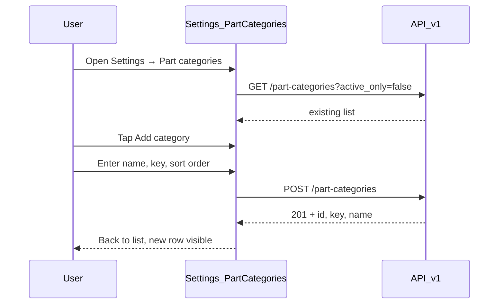
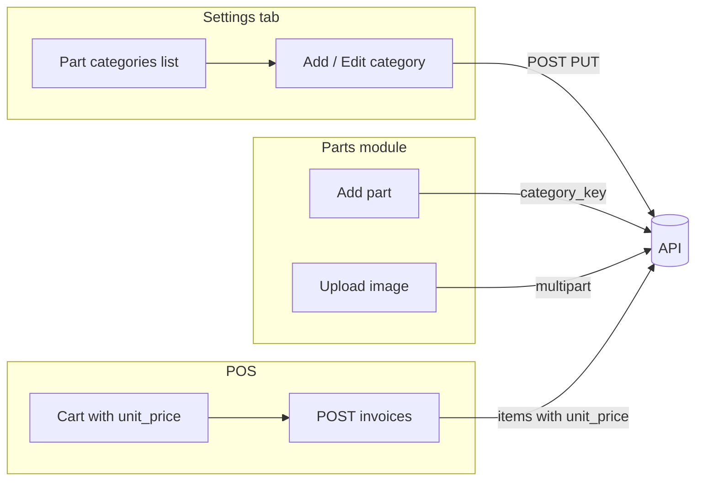

# FrostParts Windows — recent API updates & app work

Guide for the **Flutter Windows ERP** client: what changed on the API, what to build in the app, and how it fits the existing architecture.

**Related docs**

| Topic | Document |
|-------|----------|
| Full app blueprint | [flutter-windows-pos-offline-guide.md](./flutter-windows-pos-offline-guide.md) |
| Add part flow | [flutter-add-part.md](./flutter-add-part.md) |
| Part images | [part-image-api.md](./part-image-api.md) |
| Categories & units API | [part-categories-units-api.md](./part-categories-units-api.md) |
| Postman | `postman/ERB-Frezzer-API.postman_collection.json` |

---

## 1. Summary of backend changes

| Feature | API | Offline? |
|---------|-----|----------|
| **POS line price override** | `POST /invoices` — optional `items[].unit_price` | Yes — store in `pending_invoice_items`, sync with sale |
| **Part image** | `POST/DELETE /parts/{id}/image`, `image_url` on part JSON | No — online only |
| **Create part categories** | `POST /part-categories` (Settings screen) | No — **build in Settings tab** (admin/manager); see **§4** |
| **Catalog fields** | Parts use `category_key`, `unit` enum, `image_url` | Cache `image_url` on catalog sync |

After deploy, run migrations (or `migrate:fresh --seed` on dev). Images need `php artisan storage:link` on the server (Docker entrypoint does this).

---

## 2. POS — per-sale price override

When the shop buys stock from a nearby supplier, the cashier can sell at a **different price for this invoice only**. The catalog `sell_price` on the part is **not** updated.

### API

```http
POST /api/v1/invoices
Content-Type: application/json
Authorization: Bearer <token>
```

```json
{
  "customer_id": "uuid",
  "branch_id": "uuid",
  "payment_type": "cash",
  "discount": 0,
  "items": [
    { "part_id": "uuid", "quantity": 2, "unit_price": 175.5 }
  ]
}
```

| Field | Required | Notes |
|-------|----------|--------|
| `items[].part_id` | Yes | |
| `items[].quantity` | Yes | Integer ≥ 1 |
| `items[].unit_price` | No | If omitted, server uses part `sell_price` |

**Roles:** `admin`, `manager`, `salesperson` (same as create invoice today).

### Windows app — POS screen

1. When a part is added to the cart, set line `unit_price = part.sell_price` (from synced catalog).
2. Add an editable **Price** column (numeric field) per cart line.
3. Recalculate line total and cart subtotal locally: `line_total = quantity × unit_price`.
4. On **Complete sale** (online): send each line with `unit_price` in the JSON (always send the value you show, even if it equals catalog price).
5. **Offline:** persist `unit_price` in `pending_invoice_items`; sync payload must match §4.8 in [flutter-windows-pos-offline-guide.md](./flutter-windows-pos-offline-guide.md).

```dart
class CartLine {
  final String partId;
  final String partCode;
  final String partName;
  int quantity;
  double unitPrice; // editable, default from sell_price

  double get lineTotal => quantity * unitPrice;

  Map<String, dynamic> toInvoiceItemJson() => {
        'part_id': partId,
        'quantity': quantity,
        'unit_price': unitPrice,
      };
}
```

---

## 3. Part images (max 2 MB)

One image per part. Used in parts list, detail, and optional POS thumbnails.

### API

| Method | Path | Roles |
|--------|------|-------|
| `POST` | `/api/v1/parts/{id}/image` | admin, manager |
| `DELETE` | `/api/v1/parts/{id}/image` | admin, manager |

Multipart field name: **`image`**. Max **2048 KB**. Types: JPEG, PNG, WebP.

Part responses include:

```json
"image_url": "https://your-server.com/storage/parts/uuid.jpg"
```

`image_url` is `null` when there is no image.

Details: [part-image-api.md](./part-image-api.md) and [flutter-add-part.md](./flutter-add-part.md) §6.

### Windows app — parts UI

| Screen | Work |
|--------|------|
| Add / Edit part | Optional “Choose image” → `POST /parts/{id}/image` after create or on save |
| Parts list | Thumbnail from `image_url` or placeholder |
| Catalog sync | Store `image_url` in local `parts` table for offline display (read-only) |

**Client checks:** file size ≤ 2 MB; extension `.jpg`, `.jpeg`, `.png`, `.webp`. Use `file_picker` on Windows.

---

## 4. Settings — create & manage part categories

**Goal:** Let admin/manager **create new categories** from the Windows app (not only use seeded ones). Every part must belong to a category (`category_key` on `POST /parts`).

Units stay a **fixed enum** from `GET /part-units` — do **not** build a units CRUD screen in Settings.

### 4.0 Create a category — step by step (Settings tab)



| Step | User action | App calls API |
|------|-------------|---------------|
| 1 | Login as **admin** or **manager** | `GET /auth/me` |
| 2 | Open **Settings** → **Part categories** | `GET /part-categories?active_only=false` |
| 3 | Tap **Add category** | — |
| 4 | Fill **Name** (e.g. `Copper tubing`) | Auto-fill **Key** → `copper_tubing` (editable) |
| 5 | Optional: **Sort order** (e.g. `8`) | Default `0` |
| 6 | Tap **Save** | `POST /part-categories` |
| 7 | Return to list | Refresh list; category appears |
| 8 | **Add part** screen | Dropdown loads `GET /part-categories` → new category available |

**Minimum request body to create:**

```json
POST /api/v1/part-categories
{
  "key": "copper_tubing",
  "name": "Copper tubing"
}
```

**Success `201`:** save `id` and `key`; show in list. Use `category_key` when creating parts.

**First-time / empty database:** run `php artisan db:seed` (or `migrate:fresh --seed`) on the server so default categories exist (`compressor`, `evaporator`, …). After that, users add more from Settings.

**Test without the app:** Postman → Parts → **Create category** (see collection) or curl:

```bash
curl -X POST "%BASE%/api/v1/part-categories" \
  -H "Authorization: Bearer TOKEN" \
  -H "Content-Type: application/json" \
  -d "{\"key\":\"copper_tubing\",\"name\":\"Copper tubing\",\"sort_order\":8}"
```

### 4.1 Navigation & access

```text
Settings (tab / drawer)
├── API connection          (existing)
├── Sync / offline prefs    (existing)
└── Part categories         ← NEW (admin, manager)
    ├── List
    ├── Add category
    └── Edit category
```

| Role | List | Add | Edit | Deactivate |
|------|------|-----|------|------------|
| `admin` | Yes | Yes | Yes | Yes (`DELETE`) |
| `manager` | Yes | Yes | Yes | No |
| `salesperson` | Hidden | — | — | — |
| `warehouse` | Hidden | — | — | — |

Hide the menu entry when `user.role` is not `admin` or `manager` (use `GET /auth/me` after login).

Suggested route: `/settings/part-categories` (child of settings shell).

### 4.2 List screen

**Load categories (include inactive for management):**

```http
GET /api/v1/part-categories?active_only=false
Authorization: Bearer <token>
```

Response: JSON array of category objects:

```json
[
  {
    "id": "uuid",
    "key": "compressor",
    "name": "Compressor",
    "sort_order": 1,
    "is_active": true,
    "created_at": "2026-05-20T10:00:00.000000Z",
    "updated_at": "2026-05-20T10:00:00.000000Z"
  }
]
```

**UI**

- `DataTable` or `ListView`: columns **Name**, **Key**, **Sort order**, **Active** (badge).
- Sort by `sort_order` then `name` (server already orders; keep same after local edits).
- FAB or **Add category** button → add form.
- Row tap → edit form.
- Pull-to-refresh or refresh after save (online only).

For **Add part** dropdowns, keep using `GET /part-categories` with default `active_only=true` (only active categories).

### 4.3 Add category form (create screen)

**Screen title:** `Add category`  
**Buttons:** Cancel | **Save** (calls `POST`, disabled until name + valid key)

```http
POST /api/v1/part-categories
Content-Type: application/json
Authorization: Bearer <token>
```

```json
{
  "key": "custom_coils",
  "name": "Custom Coils",
  "sort_order": 10,
  "is_active": true
}
```

**On success (`201`):** `Navigator.pop(context, true)` → parent list refreshes.

**On error (`422`):** show `errors.key` / `errors.name` under fields.

**Example Flutter save handler:**

```dart
Future<void> saveNewCategory() async {
  final key = keyController.text.trim();
  final name = nameController.text.trim();
  if (key.isEmpty || name.isEmpty) return;

  try {
    await partCategoryApi.create(
      key: key,
      name: name,
      sortOrder: int.tryParse(sortOrderController.text) ?? 0,
    );
    if (context.mounted) Navigator.pop(context, true);
  } on DioException catch (e) {
    showValidationErrors(e.response?.data);
  }
}
```

| Field | Rules | Flutter hint |
|-------|--------|----------------|
| `key` | Required; `a-z`, `0-9`, `_` only; unique; max 64 | Auto-slug from name, user can edit |
| `name` | Required; max 255 | Display name |
| `sort_order` | Optional; integer ≥ 0 | Default `0` |
| `is_active` | Optional boolean | Default `true` |

**Key slug helper (example):**

```dart
String slugifyCategoryKey(String name) {
  return name
      .toLowerCase()
      .replaceAll(RegExp(r'[^a-z0-9]+'), '_')
      .replaceAll(RegExp(r'_+'), '_')
      .replaceAll(RegExp(r'^_|_$'), '');
}
```

**422 examples:** duplicate `key`, invalid `key` format.

### 4.4 Edit category form

```http
PUT /api/v1/part-categories/{id}
```

Send only changed fields, e.g.:

```json
{
  "name": "Coils & Condensers",
  "sort_order": 5,
  "is_active": true
}
```

Avoid changing `key` after parts use it unless you control all parts; prefer editing `name` and `sort_order`.

### 4.5 Deactivate category (admin only)

```http
DELETE /api/v1/part-categories/{id}
```

Soft-deletes: sets `is_active` to `false`. Response `204`.

Show a confirmation dialog. Categories with existing parts may still be referenced by old data; deactivating hides them from default list (`active_only=true`) but does not delete parts.

### 4.6 Dio service example

```dart
class PartCategoryApi {
  PartCategoryApi(this._dio);
  final Dio _dio;

  Future<List<PartCategory>> list({bool activeOnly = false}) async {
    final res = await _dio.get(
      '/part-categories',
      queryParameters: {'active_only': activeOnly},
    );
    return (res.data as List)
        .map((e) => PartCategory.fromJson(e as Map<String, dynamic>))
        .toList();
  }

  Future<PartCategory> create({
    required String key,
    required String name,
    int sortOrder = 0,
    bool isActive = true,
  }) async {
    final res = await _dio.post('/part-categories', data: {
      'key': key,
      'name': name,
      'sort_order': sortOrder,
      'is_active': isActive,
    });
    return PartCategory.fromJson(res.data as Map<String, dynamic>);
  }

  Future<PartCategory> update(
    String id, {
    String? key,
    String? name,
    int? sortOrder,
    bool? isActive,
  }) async {
    final res = await _dio.put('/part-categories/$id', data: {
      if (key != null) 'key': key,
      if (name != null) 'name': name,
      if (sortOrder != null) 'sort_order': sortOrder,
      if (isActive != null) 'is_active': isActive,
    });
    return PartCategory.fromJson(res.data as Map<String, dynamic>);
  }

  Future<void> deactivate(String id) async {
    await _dio.delete('/part-categories/$id');
  }
}
```

### 4.7 After category changes

- Refresh in-memory category cache used by **Add part** / **Edit part** screens.
- Optional: trigger catalog sync if POS filters by category.
- No offline queue for categories — show “Internet required” if offline.

### 4.8 Default seeded categories

Fresh DB seed includes: `compressor`, `evaporator`, `fan_motor`, `controls`, `electrical`, `refrigerant`, `seals`. Settings list should show these on first connect.

---

## 5. Settings tab — wiring checklist

Add to your Settings module (see folder layout in [flutter-windows-pos-offline-guide.md](./flutter-windows-pos-offline-guide.md) §9):

- [ ] `settings/part_categories_screen.dart` — list
- [ ] `settings/part_category_form_screen.dart` — add/edit
- [ ] Register routes under `/settings/part-categories` and `/settings/part-categories/new`, `/settings/part-categories/:id/edit`
- [ ] Show **Part categories** tile only for `admin` / `manager`
- [ ] `PartCategoryApi` (or extend existing repository)
- [ ] Error handling: `401` → login; `403` → permission message; `422` → field errors

**Existing settings** (keep as-is):

| Setting | Storage |
|---------|---------|
| API base URL | secure / shared_preferences |
| Last catalog sync | `app_meta` |
| Offline cash-only | preferences |

---

## 6. End-to-end flows (quick reference)



---

## 7. Testing checklist (Windows app)

**POS**

- [ ] Default line price = catalog `sell_price`
- [ ] Edited `unit_price` on invoice matches server `invoice_items.unit_price`
- [ ] Offline sale syncs with custom `unit_price`
- [ ] Omitting `unit_price` still works (catalog price)

**Images**

- [ ] Upload ≤ 2 MB succeeds; `image_url` shows in list
- [ ] Over 2 MB / PDF rejected before or at API
- [ ] Delete image clears thumbnail

**Settings — categories**

- [ ] Admin/manager see Part categories; salesperson does not
- [ ] Create category with valid `key`; appears in Add part dropdown
- [ ] Edit name / sort order
- [ ] Admin deactivate hides from active-only list
- [ ] Offline shows clear message

---

## 8. Backend deploy reminder

```bash
php artisan migrate --force
php artisan storage:link   # if not using Docker entrypoint
```

On dev with empty DB:

```bash
php artisan migrate:fresh --seed
```
